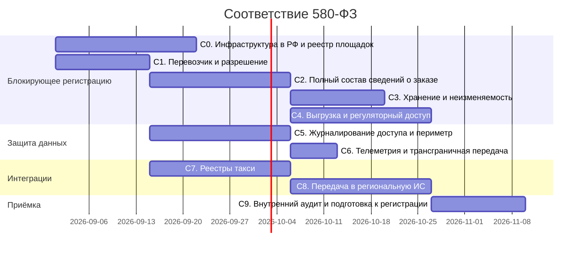

# План реализации: соответствие 580-ФЗ — Nur Taxi

> План выполнения требований `580fz.requirements.md`. Организован по фазам: от локализации
> инфраструктуры к полноте журнала заказов, выгрузкам и интеграциям. Каждая задача имеет
> ссылки на требования, зависимости и критерии готовности.
>
> - **Версия:** 1.1
> - **Дата:** 27 августа 2026
> - **Цель:** регистрация Nur Taxi в реестре служб заказа легкового такси и прохождение
>   проверки уполномоченного органа без критических несоответствий.
>
> **Статус реализации:** архитектурная часть C0–C8 в коде (миграции, API, admin UI, заглушки
> интеграций). Не закрыто: живой ЦОД (B.6), заполнение справочников перевозчиков (B.4),
> боевые адаптеры реестра/РИС (B.3, B.1), нагрузочный прогон выгрузки, обучение операторов,
> шифрование полей документов, аттестация (B.7).

---

## Условные обозначения
- **Приоритет:** P0 (блокирует регистрацию или проверку), P1 (обязательно к началу
  коммерческой эксплуатации), P2 (полнота соответствия, допускается после запуска).
- **FZ:** ссылка на `580fz.requirements.md`. **Req:** ссылка на `requirements.md`.
  **Des:** ссылка на `design.md`.
- **DoD:** Definition of Done — критерий завершённости фазы.
- Фазы пронумерованы с префиксом `C` (compliance), чтобы не пересекаться с нумерацией
  продуктовых фаз в `tasks.md`.

---

## Дорожная карта (обзор фаз)



Сроки ориентировочные, приведены для оценки последовательности и параллелизма.
Фазы C7 и C8 доводятся до боевых адаптеров только после ответов на открытые вопросы
из Приложения B спецификации.

---

## Что переиспользуется из существующей системы

Аудит выявил заделы, на которые опирается план. Их не нужно проектировать заново:

| Задел | Где | Что закрывает |
|-------|-----|---------------|
| `DocumentAutoVerifier` — интерфейс с DI-токеном и заглушкой | `server/src/modules/drivers/verification/` | Точка подключения автопроверки в реестре (C7.7) |
| Outbox-паттерн с таблицей событий и процессором | `server/src/modules/payments/outbox.service.ts` | Гарантированная доставка в РИС после выноса в общий модуль (C8.1) |
| `feature_flags` на регионе, читаемые в рантайме | `server/src/modules/regions/entities/region.entity.ts` | Региональные признаки обязательности проверки и передачи в РИС (C7.3, C8.5) |
| `ProviderConfig` с `credentialsRef` на защищённое хранилище | `server/src/modules/admin/entities/provider-config.entity.ts` | Конфигурация поставщика сведений реестра по региону (C7.2) |
| `resilientCall` с таймаутом, ретраями и circuit breaker | `server/src/common/resilience/` | Обращения к внешним реестрам (C7.1) |
| `AdminScopeService` — региональная изоляция | `server/src/modules/admin/admin-scope.service.ts` | Распространение скоупа на новые сущности (C5.12) |
| `order_status_logs` с актором и причиной перехода | `server/src/modules/orders/entities/` | Основа журнала заказов, требует защиты и дополнения (C2, C3) |
| Маскирование ПДн в логах | `server/src/observability/logger.config.ts` | Расширяется на новые поля (C6.6) |

---

## Фаза C0. Локализация инфраструктуры и реестр площадок (P0)
FZ §4, §12 · Req §26 · Des §14

- [x] **C0.1** Выбор облачного провайдера и оператора ЦОД в РФ, фиксация зоны размещения. Решение оформляется как ADR. — *FZ-01.1, открытый вопрос B.6* *(ADR `0001`, зона `ru-central-1` — рабочая гипотеза до закрытия B.6)*
- [x] **C0.2** Terraform: описание кластера, БД, объектного хранилища и сети в выбранной российской зоне вместо подключения к готовому кластеру. — *FZ-01.1* *(скелет `infra/terraform/yandex`, apply только после `folder_id`)*
- [ ] **C0.3** Резервные копии, реплики БД и хранилище логов размещаются в РФ наравне с основной площадкой. — *FZ-01.6* *(заложено в ADR; живые бэкапы не проверены)*
- [x] **C0.4** Замена зарубежных значений по умолчанию: явный регион объектного хранилища вместо `us-east-1`, удаление примера бэкенда состояния с `eu-central-1`. — *FZ-01.2, FZ-01.3*
- [x] **C0.5** Реестр контейнерных образов в РФ; шаг деплоя в CI доводится до рабочего состояния вместо текущей заглушки. — *FZ-01.4* *(публикация при наличии `CR_REGISTRY`)*
- [x] **C0.6** Сущность площадки размещения: оператор, фактический адрес, регион, назначение, договор, период. Миграция и admin API. — *FZ-09.1*
- [x] **C0.7** Сопоставление компонентов инфраструктуры с площадками, ведётся вместе с инфраструктурным кодом. — *FZ-09.2*
- [x] **C0.8** Раздел реестра площадок в административной панели и выгрузка документа для приложения к заявлению. — *FZ-09.3*
- [x] **C0.9** Журналирование изменений реестра с возможностью определить размещение на любую дату; учёт субподрядчиков. — *FZ-09.4, FZ-09.5*
- [x] **C0.10** (P2) Проверка в CI, блокирующая сборку при появлении зарубежных регионов или endpoint'ов из запрещённого списка. — *FZ-01.5*
- **DoD:** развёртывание с нуля создаёт всю инфраструктуру в российской зоне; реестр площадок заполнен, выгружается документом и соответствует фактическим endpoint'ам.

---

## Фаза C1. Перевозчик, разрешение, транспортное средство (P0)
FZ §7, §14.1 · Req §13.1

- [x] **C1.1** Сущность перевозчика: наименование, организационно-правовая форма, ИНН, ОГРН/ОГРНИП, адрес, контакты, регион, статус в реестре. — *FZ-04.1*
- [x] **C1.2** Сущность разрешения: номер, орган выдачи, даты выдачи и окончания, связанные ТС и перевозчик, статус. — *FZ-04.2*
- [x] **C1.3** Историческая связь водителя и транспортного средства с перевозчиком: период действия, основание, восстановление состояния на любую дату. — *FZ-04.3*
- [x] **C1.4** Дополнение транспортного средства: VIN, связь с действующим разрешением. — *FZ §14.2*
- [x] **C1.5** Административный интерфейс: реестр перевозчиков и разрешений, привязка водителей и ТС, контроль срока действия разрешения. — *FZ-04.1, FZ-04.2*
- [ ] **C1.6** Заполнение справочников по действующим водителям. Объём зависит от модели работы — через таксопарк или самозанятость. — *открытый вопрос B.4*
- [x] **C1.7** Оповещение оператора об истекающих разрешениях. — *P1, FZ-06.5*
- **DoD:** у каждого водителя, допущенного к линии, определён перевозчик и действующее разрешение либо явно зафиксировано документированное основание их отсутствия.

---

## Фаза C2. Полный состав сведений о заказе (P0)
FZ §7 · Req §13.3 · Des §5

- [x] **C2.1** Снимок сведений в заказе на момент назначения: перевозчик, разрешение, водитель, транспортное средство, контактные данные. Последующие изменения справочников не влияют на завершённые заказы. — *FZ-04.4*
- [x] **C2.2** Явные поля фактического начала и окончания поездки, заполняемые при переходах в соответствующие статусы. — *FZ-04.5*
- [x] **C2.3** Персистентный журнал передачи заказа: кому предложен, когда, с каким таймаутом, каков исход, кому назначен. Перенос из кэша с временем жизни 30 секунд в БД. — *FZ-04.6*
- [x] **C2.4** Человекочитаемый номер заказа, уникальный и последовательный, используется в интерфейсах и выгрузках. — *P1, FZ-04.7*
- [x] **C2.5** Проверка полноты обязательных сведений при переходе заказа в терминальный статус, метрика нарушений. — *P1, FZ-04.9*
- [x] **C2.6** Заполнение снимков по историческим заказам; недостающие значения помечаются как исторически недоступные. — *FZ §14.3*
- [x] **C2.7** (P2) Промежуточные точки маршрута с сохранением в журнале. — *FZ-04.8*
- **DoD:** по случайной выборке завершённых заказов выгружается полный обязательный набор сведений; смена водителем автомобиля или перевозчика не изменяет ранее завершённые заказы.

---

## Фаза C3. Хранение, неизменяемость, резервное копирование (P0)
FZ §6 · Des §12

- [x] **C3.1** Минимальный срок хранения сведений о заказе — 6 месяцев после завершения или отмены; конфигурируется только в большую сторону. — *FZ-03.1*
- [x] **C3.2** Отмена каскадного удаления журнала переходов, маршрута, трека и связанных записей при удалении заказа. — *FZ-03.2*
- [x] **C3.3** Защита журналов на уровне БД: триггеры запрета изменения и удаления записей журнала переходов, отдельная роль приложения без прав на удаление. — *FZ-03.3, FZ-08.14*
- [ ] **C3.4** Автоматические резервные копии с шифрованием, хранением в РФ, разграничением доступа и регулярной проверкой восстановления. — *FZ-03.4, FZ-08.17*
- [x] **C3.5** Процедура удаления и обезличивания по истечении срока: не затрагивает записи моложе минимального срока, фиксирует факт выполнения. — *P1, FZ-03.5*
- [x] **C3.6** Политика хранения данных как версионируемый документ в репозитории. — *P1, FZ-03.7*
- [ ] **C3.7** (P2) Контрольные суммы ключевых полей записей журнала для подтверждения неизменности. — *FZ-03.6*
- **DoD:** попытка удалить заказ или запись журнала переходов из приложения и напрямую в БД под учётной записью приложения завершается отказом; восстановление из резервной копии выполнено и задокументировано.

---

## Фаза C4. Выгрузка журнала и регуляторный доступ (P0)
FZ §8, §13

- [x] **C4.1** Выгрузка журнала за период без ограничения количества записей: потоковая генерация вместо текущего лимита в 5000 строк. — *FZ-05.1*
- [x] **C4.2** Состав выгрузки по обязательному набору с историей статусов, регионом, суммой, способом оплаты и причиной отмены. — *FZ-05.2*
- [x] **C4.3** Форматы CSV и машиночитаемый структурированный; кодировка и разделители зафиксированы и задокументированы. — *FZ-05.3*
- [x] **C4.4** Фильтрация по дате завершения или создания на выбор, произвольный период без ограничения сверху. — *P1, FZ-05.4*
- [x] **C4.5** Асинхронные выгрузки: очередь, сохранение результата, ссылка с ограниченным сроком жизни. — *P1, FZ-05.5*
- [x] **C4.6** Экспорт и фильтр по диапазону дат в реестре заказов административной панели, а не только в разделе аналитики. — *P1, FZ-05.6*
- [x] **C4.7** Контрольная сумма файла выгрузки, сохраняется вместе с параметрами запроса. — *FZ-05.7, FZ-10.3*
- [x] **C4.8** Роль регуляторного доступа: просмотр и выгрузка журнала без прав на изменение. — *FZ-10.1*
- [x] **C4.9** Оформление регуляторной выгрузки как операции: основание, реквизиты запроса, период, объём, инициатор. — *FZ-10.2*
- [x] **C4.10** Отдельный журнал фактов предоставления сведений, защищённый от изменения, со сроком хранения не меньше журнала заказов. — *FZ-10.4*
- [ ] **C4.11** Нагрузочная проверка выгрузки за год, фиксация целевого времени в нефункциональных требованиях. — *P1, FZ-10.5, FZ-NF.5*
- [x] **C4.12** Внутренний регламент обработки запроса уполномоченного органа: кто принимает, кто исполняет, в какой срок и в каком формате. — *P1, FZ-10.6*
- [ ] **C4.13** (P2) Интерфейс прямого доступа, если установленный порядок его предусматривает. — *FZ-10.7, открытый вопрос B.2*
- **DoD:** выгрузка за период с числом заказов, превышающим прежний лимит, содержит все записи; контрольная сумма воспроизводится при повторной генерации; создание выгрузки зафиксировано.

---

## Фаза C5. Журналирование доступа и защита периметра (P0/P1)
FZ §11 · Req §20 · Des §9

- [x] **C5.1** Журналирование операций чтения сведений о заказах и персональных данных, а не только изменяющих запросов. — *FZ-08.4*
- [x] **C5.2** Дополнение записи журнала: user-agent, результат операции, прежнее и новое значение для изменяющих операций. — *FZ-08.5*
- [x] **C5.3** Журналирование событий аутентификации: вход, неудачные попытки, обновление и отзыв токена, выход. — *FZ-08.6*
- [x] **C5.4** Защита журнала действий от изменения и удаления, срок хранения не меньше журнала заказов. — *FZ-08.7*
- [x] **C5.5** Раздел журнала действий в административной панели с фильтрами по актору, периоду, типу действия и региону. — *P1, FZ-08.8*
- [x] **C5.6** HSTS и принудительное перенаправление на защищённое соединение в продуктиве; послабления для инструментов разработки не попадают в продуктивную конфигурацию. — *FZ-08.9*
- [x] **C5.7** Соединение с базой данных по TLS с проверкой сертификата; режим без проверки запрещён в продуктиве. — *FZ-08.10*
- [x] **C5.8** Соединение с Redis по TLS с аутентификацией. — *P1, FZ-08.11*
- [x] **C5.9** Список разрешённых источников для кросс-доменных запросов и WebSocket вместо разрешения любых источников. — *FZ-08.12*
- [x] **C5.10** Публикация административной панели только по защищённому соединению. — *FZ-08.13*
- [x] **C5.11** Загрузка секретов из защищённого хранилища во время исполнения; отказ старта в продуктиве при незаданных или дефолтных секретах. — *FZ-08.15*
- [x] **C5.12** Распространение ролевой модели и региональной изоляции на новые сущности: перевозчик, разрешение, трек, выгрузки, реестр площадок. — *FZ-08.1*
- [x] **C5.13** Единая матрица прав для API и интерфейса, устранение расхождений. — *P1, FZ-08.2*
- [ ] **C5.14** Шифрование наиболее чувствительных полей: номера документов, реквизиты разрешений. — *P1, FZ-08.16*
- [x] **C5.15** Хранение токенов административной панели способом, устойчивым к межсайтовому скриптингу. — *P1, FZ-08.18*
- [ ] **C5.16** Расширение тестов безопасности: региональная изоляция, чтение чужих данных, перебор кода подтверждения, проверка журналирования доступа. — *P1, FZ-08.19*
- [ ] **C5.17** (P2) Пороги на объём массового чтения персональных данных с оповещением при превышении. — *FZ-08.3*
- **DoD:** попытка сотрудника прочитать заказ чужого региона отклоняется и фиксируется в журнале; продуктивная конфигурация не стартует при отсутствии секретов или отключённой проверке сертификата БД.

---

## Фаза C6. Телеметрия и трансграничная передача (P0/P1)
FZ §5 · Des §13

- [x] **C6.1** Обработчик `beforeSend` в серверном сборщике ошибок: вычистка телефонов, ФИО, адресов, координат, идентификаторов пользователей и тела запроса — по образцу мобильных приложений. — *FZ-02.1*
- [x] **C6.2** Размещение сборщика ошибок в РФ либо отключение в продуктивной среде. — *FZ-02.2*
- [x] **C6.3** Санитизация трассировки: SQL без значений параметров, HTTP-спаны без query string и тела; коллектор в РФ. — *FZ-02.3*
- [ ] **C6.4** Канал доставки push-уведомлений с подтверждённым размещением; в внешний сервис передаётся только токен устройства и обезличенный идентификатор события. — *P1, FZ-02.4*
- [x] **C6.5** Машиночитаемый реестр внешних обработчиков: сервис, назначение, состав данных, юрисдикция, переменная конфигурации. — *P1, FZ-02.5*
- [x] **C6.6** Расширение маскирования в логах на ФИО, адрес проживания, дату рождения, реквизиты документов, госномер. — *P1, FZ-02.6*
- [x] **C6.7** (P2) Тест, проверяющий отсутствие образцов персональных данных в исходящей телеметрии. — *FZ-02.7*
- **DoD:** сценарий «ошибка 500 на эндпоинте заказа» не приводит к появлению персональных данных в исходящем событии; реестр обработчиков соответствует фактическому набору интеграций.

---

## Фаза C7. Интеграция с реестрами такси (P0 по архитектуре)
FZ §9 · Des §4.3, §11

- [x] **C7.1** Абстракция поставщика сведений реестра: проверка перевозчика, разрешения и транспортного средства, независимо от конкретной государственной системы. Обращения через `resilientCall`. — *FZ-06.1*
- [x] **C7.2** Подключение поставщика по региону через механизм конфигурации провайдеров, учётные данные в защищённом хранилище. — *FZ-06.2*
- [x] **C7.3** Региональный признак обязательности проверки: при включении водитель без подтверждённого разрешения не выходит на линию и не получает предложений. — *FZ-06.3*
- [x] **C7.4** Сохранение результата проверки: время, источник, запрос, ответ, вердикт, срок действия. Используется как доказательство при проверке. — *FZ-06.4*
- [x] **C7.5** Поведение при недоступности реестра: строгий режим с отказом или мягкий с отметкой о неподтверждённой проверке, задаётся конфигурацией. — *FZ-06.6*
- [x] **C7.6** Заглушка поставщика для сред разработки и тестирования, повторяющая контракт боевой интеграции. — *P1, FZ-06.7*
- [x] **C7.7** Встраивание автоматической проверки в существующий процесс верификации через `DocumentAutoVerifier`, без отмены ручной модерации документов. — *P1, FZ-06.8*
- [x] **C7.8** Периодическая перепроверка подтверждённых перевозчиков, разрешений и ТС; автоматическое снятие с линии при отзыве разрешения. — *P1, FZ-06.5* *(эндпоинт `POST /admin/registry-checks/recheck`; планировщик не заведён)*
- [ ] **C7.9** Отображение результатов проверок и причин отказа оператору в карточках водителя и перевозчика. — *P1, FZ-06.9*
- [ ] **C7.10** Боевой адаптер конкретного реестра. Реализуется после определения канала подключения и требований к аутентификации. — *открытый вопрос B.3*
- **DoD:** в регионе с включённой обязательной проверкой водитель с недействительным разрешением не выходит на линию и не получает предложений; история проверок доступна за весь срок хранения журнала.

---

## Фаза C8. Передача сведений в региональную ИС (P0 по архитектуре)
FZ §10 · Des §3, §10

- [x] **C8.1** Вынос механизма гарантированной доставки из платёжного модуля в общий: событие фиксируется в БД и повторяется до подтверждения. — *FZ-07.2*
- [x] **C8.2** Абстракция канала передачи: отправка сведений о поездке, о водителе и о местоположении транспортного средства; протокол реализуется адаптером. — *FZ-07.1*
- [x] **C8.3** Сохранение фактического трека поездки: координаты, время, точность, привязка к заказу; частота записи и срок хранения настраиваются по региону. — *FZ-07.4*
- [x] **C8.4** Журнал отправок: событие, регион, адресат, попытки, статус, ответ; неотправленные события накапливаются и не теряются. — *FZ-07.3*
- [x] **C8.5** Региональный признак включения передачи; при выключенной передаче события не формируются. — *FZ-07.5*
- [x] **C8.6** Конфигурируемая схема состава передаваемых сведений, чтобы адаптация под требования субъекта не требовала изменения ядра. — *P1, FZ-07.6*
- [x] **C8.7** Метрики и оповещения: размер очереди неотправленных событий, задержка доставки, доля ошибок. — *P1, FZ-07.7*
- [x] **C8.8** (P2) Повторная отправка за произвольный период по запросу оператора. — *FZ-07.8*
- [ ] **C8.9** Боевой адаптер региональной ИС. Реализуется после получения перечня передаваемых полей и протокола обмена. — *открытый вопрос B.1*
- **DoD:** при включённой передаче в тестовом регионе завершение поездки доставляет сведения в тестовый приёмник с подтверждением; остановка приёмника не приводит к потере событий, после восстановления доставка догоняет очередь.

---

## Фаза C9. Внутренний аудит и подготовка к регистрации (P0)
FZ §19 · Req §25

- [x] **C9.1** Прогон общего чек-листа приёмки из спецификации, фиксация результата по каждому пункту. — *FZ §19* *(черновик `docs/compliance/acceptance-checklist.md`)*
- [x] **C9.2** Внутренний аудит соответствия: по каждому идентификатору требования собирается доказательство — конфигурация, миграция, тест или документ. — *FZ Приложение A*
- [x] **C9.3** Комплект документов для заявления о включении в реестр: реестр площадок, политика хранения, описание мер защиты, перечень внешних обработчиков. — *FZ-09.3, FZ-03.7, FZ-02.5*
- [ ] **C9.4** Нагрузочная проверка выгрузки за год и передачи в РИС под ожидаемым объёмом. — *FZ-NF.5, FZ-NF.6*
- [ ] **C9.5** Обучение операторов и администраторов регламенту обработки запросов уполномоченных органов. — *FZ-10.6*
- [ ] **C9.6** Решение о необходимости аттестации системы и применения сертифицированных средств защиты. — *открытый вопрос B.7*
- **DoD:** чек-лист пройден полностью, по каждому требованию есть доказательство, комплект документов готов к подаче.

---

## Задачи, заблокированные открытыми вопросами

Перечисленные задачи не могут быть завершены до получения юридического заключения
или регламента. Архитектурная часть при этом реализуется заранее, чтобы подключение
конкретного регламента не требовало переработки.

| Открытый вопрос (FZ Приложение B) | Заблокированные задачи | Что делается заранее |
|-----------------------------------|------------------------|----------------------|
| B.1 Перечень полей и протокол обмена с РИС Ингушетии | C8.9 | C8.1–C8.5: канал, трек, журнал отправок, региональный признак |
| B.2 Порядок доступа уполномоченных органов | C4.13 | C4.1–C4.10: полная выгрузка, роль, оформление и фиксация факта |
| B.3 Канал подключения к государственным реестрам | C7.10 | C7.1–C7.6: абстракция, конфигурация, признак обязательности, заглушка |
| B.4 Модель работы с перевозчиками | C1.6 | C1.1–C1.5: сущности и связи с историчностью |
| B.5 Срок хранения трека поездки | Настройка по умолчанию в C8.3 | Механизм настройки срока по региону |
| B.6 Выбор оператора ЦОД | C0.1 и следом C0.2 | Подготовка конфигурации, не зависящей от провайдера |
| B.7 Необходимость аттестации | C9.6 | Меры защиты фаз C3 и C5 |
| B.8 Действия при отзыве разрешения у принятых заказов | Правило в C7.8 | Механизм перепроверки и снятия с линии |

---

## Матрица зависимостей (критический путь)

```
C0 ──────────────────────────────────────────┐
C1 → C2 → C3                                 │
        → C4 ────────────────────────────────┼→ C9
        → C8                                 │
C1 → C7                                      │
C5 → C6 ─────────────────────────────────────┘
```

- **Критический путь к регистрации:** C0 + C1 → C2 → C4 → C9.
- C3 может идти параллельно C4, но обе зависят от завершения миграций C2.
- C5 и C6 не зависят от C1–C4 и запускаются параллельно с первого дня.
- C7 и C8 не блокируют регистрацию по архитектурной части, но их боевые адаптеры
  обязательны к моменту работы в регионе, где действует соответствующее требование.

---

## Сводка соответствия фаз требованиям

| Фаза | Разделы спецификации | Приоритет | Блокирует регистрацию |
|------|----------------------|-----------|----------------------|
| C0 | §4, §12 | P0 | Да |
| C1 | §7 (§14.1) | P0 | Да |
| C2 | §7 | P0 | Да |
| C3 | §6 | P0 | Да |
| C4 | §8, §13 | P0 | Да |
| C5 | §11 | P0/P1 | Частично |
| C6 | §5 | P0/P1 | Частично |
| C7 | §9 | P0 по архитектуре | Нет |
| C8 | §10 | P0 по архитектуре | Нет |
| C9 | §19 | P0 | Да |

---

## Трассируемость требований к задачам

| Требования | Задачи |
|------------|--------|
| FZ-01.1, FZ-01.6 | C0.1, C0.2, C0.3 |
| FZ-01.2, FZ-01.3 | C0.4 |
| FZ-01.4 | C0.5 |
| FZ-01.5 | C0.10 |
| FZ-02.1, FZ-02.2 | C6.1, C6.2 |
| FZ-02.3 | C6.3 |
| FZ-02.4 | C6.4 |
| FZ-02.5 | C6.5, C9.3 |
| FZ-02.6 | C6.6 |
| FZ-02.7 | C6.7 |
| FZ-03.1 | C3.1 |
| FZ-03.2 | C3.2 |
| FZ-03.3 | C3.3 |
| FZ-03.4 | C3.4 |
| FZ-03.5 | C3.5 |
| FZ-03.6 | C3.7 |
| FZ-03.7 | C3.6, C9.3 |
| FZ-04.1, FZ-04.2 | C1.1, C1.2, C1.5 |
| FZ-04.3 | C1.3 |
| FZ-04.4 | C2.1, C2.6 |
| FZ-04.5 | C2.2 |
| FZ-04.6 | C2.3 |
| FZ-04.7 | C2.4 |
| FZ-04.8 | C2.7 |
| FZ-04.9 | C2.5 |
| FZ-05.1 | C4.1 |
| FZ-05.2 | C4.2 |
| FZ-05.3 | C4.3 |
| FZ-05.4 | C4.4 |
| FZ-05.5 | C4.5 |
| FZ-05.6 | C4.6 |
| FZ-05.7 | C4.7 |
| FZ-06.1 | C7.1 |
| FZ-06.2 | C7.2 |
| FZ-06.3 | C7.3 |
| FZ-06.4 | C7.4 |
| FZ-06.5 | C7.8, C1.7 |
| FZ-06.6 | C7.5 |
| FZ-06.7 | C7.6 |
| FZ-06.8 | C7.7 |
| FZ-06.9 | C7.9 |
| FZ-07.1 | C8.2 |
| FZ-07.2 | C8.1 |
| FZ-07.3 | C8.4 |
| FZ-07.4 | C8.3 |
| FZ-07.5 | C8.5 |
| FZ-07.6 | C8.6 |
| FZ-07.7 | C8.7 |
| FZ-07.8 | C8.8 |
| FZ-08.1 | C5.12 |
| FZ-08.2 | C5.13 |
| FZ-08.3 | C5.17 |
| FZ-08.4 | C5.1 |
| FZ-08.5 | C5.2 |
| FZ-08.6 | C5.3 |
| FZ-08.7 | C5.4 |
| FZ-08.8 | C5.5 |
| FZ-08.9 | C5.6 |
| FZ-08.10 | C5.7 |
| FZ-08.11 | C5.8 |
| FZ-08.12 | C5.9 |
| FZ-08.13 | C5.10 |
| FZ-08.14 | C3.3 |
| FZ-08.15 | C5.11 |
| FZ-08.16 | C5.14 |
| FZ-08.17 | C3.4 |
| FZ-08.18 | C5.15 |
| FZ-08.19 | C5.16 |
| FZ-09.1 | C0.6 |
| FZ-09.2 | C0.7 |
| FZ-09.3 | C0.8, C9.3 |
| FZ-09.4, FZ-09.5 | C0.9 |
| FZ-10.1 | C4.8 |
| FZ-10.2 | C4.9 |
| FZ-10.3 | C4.7 |
| FZ-10.4 | C4.10 |
| FZ-10.5 | C4.11, C9.4 |
| FZ-10.6 | C4.12, C9.5 |
| FZ-10.7 | C4.13 |
| FZ-NF.1 … FZ-NF.9 | C3.1, C3.4, C4.1, C4.11, C8.3, C8.7, C9.4 |
