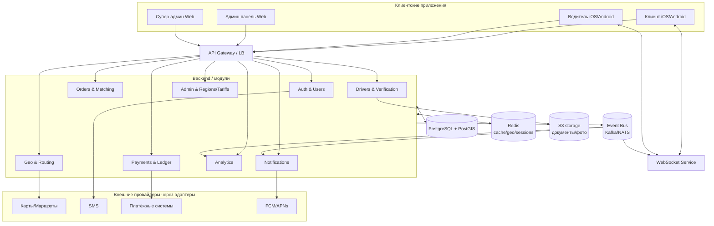
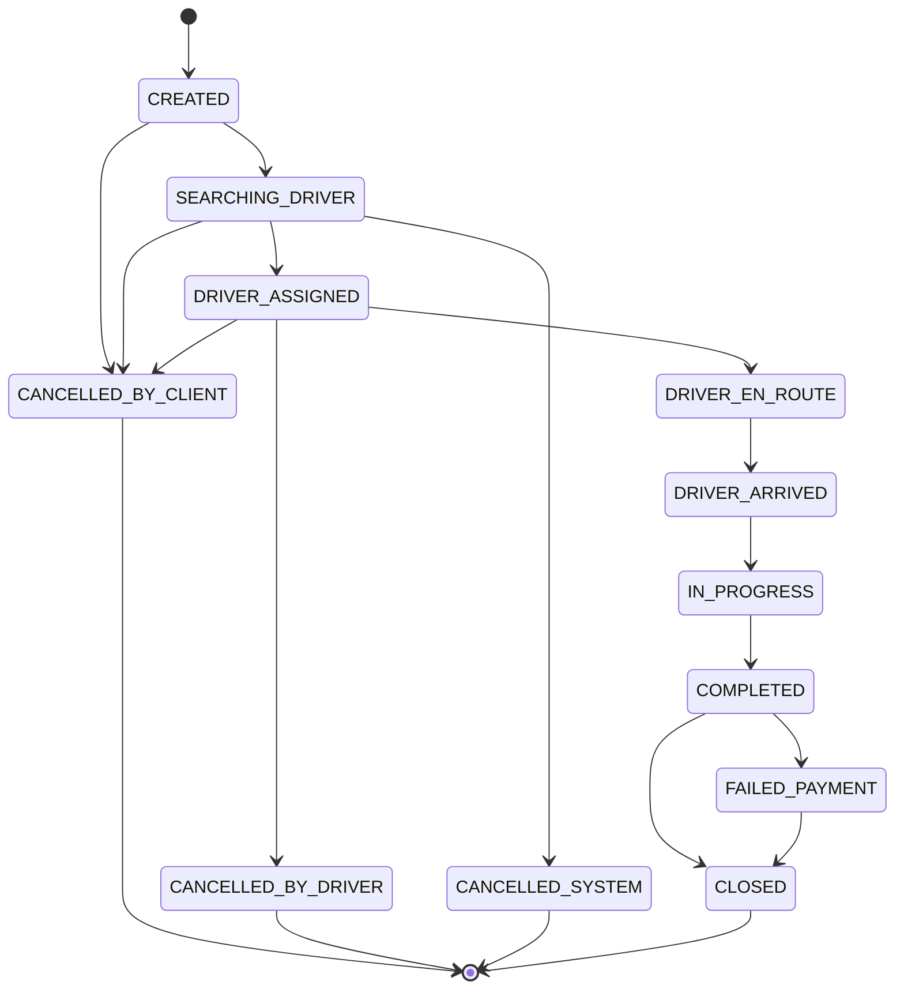
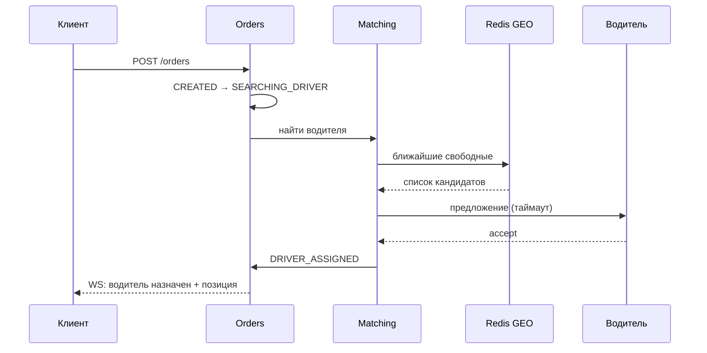

# Технические решения (Design) — Nur Taxi

> Документ описывает архитектурные и технические решения для реализации требований
> из `requirements.md`. Для каждого решения приводится обоснование и рассмотренные
> альтернативы.
>
> - **Проект:** Nur Taxi (женское такси, Северный Кавказ)
> - **Версия:** 1.0
> - **Дата:** 22 июля 2026
> - **Связанный документ:** `requirements.md`

---

## 1. Принципы, определяющие решения

Все технические решения выводятся из ценностей продукта и принципов проектирования
(`requirements.md` §2.5, §6.2):

| Принцип | Как отражается в архитектуре |
|---------|------------------------------|
| Безопасность | RBAC, шифрование, изоляция данных регионов, аудит, SOS как first-class сценарий |
| Масштабируемость | Stateless-сервисы, `region_id` в данных, конфигурация через данные |
| Прозрачность | Расчёт цены до заказа, ledger-учёт финансов, журнал статусов |
| Скорость | Гео-индексы, кэш, событийная модель, реальное время через WebSocket |
| Расширяемость без изменения кода | Feature-флаги, адаптеры провайдеров, тарифы/комиссии в БД |

**Ключевое архитектурное правило:** различия между регионами и подключение новых
услуг решаются **данными и конфигурацией**, а не изменением кода.

---

## 2. Общая архитектура

### 2.1 Стиль архитектуры
Выбран **модульный монолит на старте с чёткими границами модулей, готовый к
выделению в микросервисы**.

**Обоснование:**
- MVP запускается в одном регионе (Ингушетия) — полный микросервисный ландшафт на старте
  избыточен по стоимости эксплуатации;
- строгие границы модулей и общение через события позволяют выделять сервисы по мере роста
  нагрузки без переписывания;
- требования §6.1 к независимым компонентам сохраняются на уровне модулей и API-контрактов.

**Альтернативы:** «сразу микросервисы» (отклонено — операционная сложность на MVP),
«классический монолит без границ» (отклонено — не масштабируется, нарушает §6.2).

### 2.2 Диаграмма компонентов



### 2.3 Модули и зоны ответственности
| Модуль | Ответственность |
|--------|-----------------|
| Auth & Users | OTP-регистрация, JWT, профили, роли, настройки |
| Orders & Matching | заказы, конечный автомат статусов, подбор водителя |
| Drivers & Verification | анкеты, документы, статусы верификации, «на линии» |
| Geo & Routing | поиск адресов, расчёт маршрута/ETA/стоимости, гео-индекс |
| Payments & Ledger | оплата, комиссии, выплаты, двойная запись, чеки |
| Notifications | push/SMS/in-app, шаблоны, настройки |
| Admin & Regions | регионы, города, тарифы, провайдеры, feature-флаги |
| Analytics | метрики, отчёты, дашборды |

---

## 3. Технологический стек и обоснование

| Слой | Решение | Обоснование |
|------|---------|-------------|
| Backend | **NestJS (Node.js, TypeScript)** | модульность из коробки (DI, модули), единый язык с мобильной/веб-командой, быстрый I/O для real-time |
| Мобильные приложения | **Flutter** | одна кодовая база на iOS/Android → быстрее MVP, ниже стоимость поддержки |
| Админ-панели | **React + TypeScript** | зрелая экосистема, RBAC-компоненты, общие типы с backend |
| Основная БД | **PostgreSQL + PostGIS** | ACID для финансов, гео-запросы для матчинга, партиционирование по региону |
| Кэш / гео / сессии | **Redis** (+ GEO/H3) | быстрый поиск ближайших водителей, кэш тарифов/справочников |
| Реальное время | **WebSocket (Socket.IO)** | статусы заказа и позиция водителя в реальном времени |
| Брокер событий | **NATS (JetStream)** на старте | лёгкий, простой в эксплуатации; при росте — переход на Kafka |
| Хранилище файлов | **S3-совместимое (MinIO/облако)** | документы и фото водителей, приватный доступ по подписанным URL |
| Наблюдаемость | **Prometheus + Grafana + OpenTelemetry + Sentry** | метрики KPI, трейсинг, алёрты |
| Инфраструктура | **Docker + Kubernetes + Helm + Terraform** | горизонтальное масштабирование, IaC, canary/blue-green |
| CI/CD | **GitLab CI / GitHub Actions** | автотесты, сканирование, поэтапный деплой |

> Стек — рекомендованный; допустимы эквиваленты (Go/Spring для backend) при сохранении
> принципов §1.

---

## 4. Мультирегиональность и конфигурируемость

### 4.1 Модель данных
- каждая регионально-зависимая сущность содержит `region_id`;
- **Region** хранит `feature_flags`, `currency`, `timezone`, набор активных провайдеров;
- **Tariff** и `commission_percent` — записи в БД с `effective_from` (плановое применение).

### 4.2 Feature Flags
Функции включаются/отключаются по регионам через флаги (например, `family_account`,
`promo_codes`, `surge_pricing`). Проверка флага — на уровне сервиса и на клиенте
(конфиг возвращается при старте сессии).

### 4.3 Адаптеры провайдеров (Strategy/Adapter)
Карты, SMS, платежи скрыты за интерфейсами:

```
interface MapProvider { search(); route(); eta(); }
interface SmsProvider { sendCode(); }
interface PaymentProvider { charge(); refund(); payout(); }
```

Конкретная реализация выбирается по `ProviderConfig` региона в рантайме (фабрика).
**Результат:** смена провайдера или добавление региона — изменение данных, не кода
(`requirements.md` §6.3).

---

## 5. Заказы и конечный автомат статусов

### 5.1 Реализация
- статусная модель (`requirements.md` §12) реализуется как явный **state machine** с
  проверкой разрешённых переходов; недопустимый переход → ошибка домена;
- каждый переход пишет запись в `OrderStatusLog` и публикует событие `order.status_changed`;
- переходы выполняются в транзакции БД с оптимистичной блокировкой (`version`), чтобы
  исключить гонки (например, одновременная отмена клиентом и принятие водителем).

### 5.2 Диаграмма статусов



---

## 6. Матчинг водителя

### 6.1 Алгоритм
1. при статусе `SEARCHING_DRIVER` сервис запрашивает ближайших свободных водителей;
2. кандидаты берутся из **Redis GEO** (позиции обновляются водителями через WebSocket);
3. ранжирование: расстояние → рейтинг → приоритет «избранных водителей» клиента;
4. предложение отправляется кандидату с тайм-аутом; при отказе/тайм-ауте — следующий;
5. цель — среднее время назначения ≤ 30 с (`requirements.md` §10.1).

### 6.2 Обоснование хранения позиций в Redis
Позиции водителей — часто меняющиеся, недолговечные данные; хранить их в PostgreSQL дорого
по нагрузке на запись. Redis GEO даёт быстрый радиус-поиск. PostGIS используется для
статичной геоаналитики и границ городов.

### 6.3 Диаграмма последовательности



---

## 7. Геолокация, маршрутизация, стоимость

- **Поиск адресов** (§8.9) — через `MapProvider.search()` с учётом региональных особенностей
  адресации СК; результаты кэшируются в Redis;
- **Маршрут и ETA** — `MapProvider.route()`; для матчинга ETA подачи считается от позиции водителя;
- **Стоимость** рассчитывается из `Tariff` региона: `base_fare + km*price_per_km +
  min*price_per_min`, не ниже `min_price`, с учётом `surge_rules` (если флаг включён);
- расчёт цены выполняется **до создания заказа** (endpoint `/orders/estimate`) — принцип прозрачности.

---

## 8. Платежи и финансы

### 8.1 Решения
- **двойная запись (ledger)**: каждая операция — пара проводок; баланс водителя/платформы
  считается из журнала, что обеспечивает аудируемость;
- **идемпотентность**: каждая платёжная операция несёт `idempotency_key`; повтор запроса
  не приводит к двойному списанию;
- **атомарность**: изменение статуса заказа и финансовая проводка — в согласованной
  транзакции; интеграция с внешним PSP — через **outbox pattern** (сначала запись события
  в БД, затем гарантированная доставка);
- **комиссии** удерживаются по `commission_percent` региона; выплаты водителям — через
  `PaymentProvider.payout()`;
- **чеки/квитанции** формируются при переходе в `CLOSED`.

### 8.2 Обработка сбоя оплаты
`COMPLETED → FAILED_PAYMENT` с retry (экспоненциальная задержка); при исчерпании попыток —
эскалация оператору (компенсация/спор), заказ не «теряется».

---

## 9. Безопасность

| Требование | Решение |
|-----------|---------|
| Аутентификация | OTP по SMS + JWT (access ~15 мин, refresh с ротацией) |
| Авторизация | RBAC по ролям (client/driver/operator/regional_admin/super_admin) |
| Изоляция регионов | региональный админ видит только свой `region_id` (row-level фильтрация) |
| Защита OTP | rate limiting, лимит попыток, временная блокировка номера |
| Документы водителей | приватный S3, доступ по коротко живущим подписанным URL |
| Данные в покое | шифрование чувствительных полей; секреты в Vault |
| Трафик | TLS 1.2+ |
| 152-ФЗ | явное согласие, минимизация, маскирование ПДн в логах, право на удаление |
| Аудит | лог действий операторов и администраторов |

SOS-сценарий реализован как приоритетный: событие `sos.activated` рассылает контактам
ссылку/координаты/данные водителя и поднимает приоритетное уведомление оператору.

---

## 10. Реальное время и события

- **WebSocket-каналы** `client:{id}`, `driver:{id}`, `order:{id}` (совместное отслеживание
  клиентом, семьёй и SOS-контактами);
- **event bus** (NATS JetStream) с гарантией **at-least-once** и идемпотентными обработчиками;
- ключевые события: `order.*`, `driver.location_updated`, `payment.*`, `sos.activated`,
  `document.verified`, `review.created`;
- WebSocket-сервис масштабируется горизонтально с общим состоянием подписок в Redis (pub/sub).

---

## 11. Надёжность и отказоустойчивость

- отсутствие единой точки отказа: несколько инстансов сервисов, PostgreSQL primary/replica;
- **circuit breaker + retry + timeout** для всех внешних вызовов (карты, SMS, PSP);
- **graceful degradation**: недоступность аналитики/промо не блокирует заказ;
- health-checks, автоперезапуск, readiness/liveness-пробы в Kubernetes;
- резервное копирование БД и регулярная проверка восстановления (DR); цель RTO ≤ 30 мин.

---

## 12. Масштабирование

- stateless-сервисы за балансировщиком, автоскейлинг по CPU/латентности;
- партиционирование крупных таблиц (`orders`, `order_status_log`, `payments`) по `region_id`
  и/или времени;
- кэширование справочников, тарифов и гео-поиска в Redis;
- асинхронная обработка тяжёлых задач (уведомления, аналитика, OCR) через очереди;
- нагрузочное тестирование перед запуском нового региона.

---

## 13. Наблюдаемость

- **метрики KPI**: время назначения водителя, латентность API, доля успешных заказов/платежей,
  доступность (Prometheus + Grafana);
- **распределённая трассировка** сквозным `trace_id` (OpenTelemetry);
- **структурированные логи** (JSON) в OpenSearch;
- **алёрты** на нарушение KPI и критические сбои; **Sentry** для ошибок приложений.

---

## 14. Развёртывание и окружения

- окружения `dev → staging → production`, инфраструктура как код (Terraform + Helm);
- CI/CD: линт → тесты (unit/integration/e2e) → сборка образов → сканирование → деплой;
- стратегия деплоя **blue-green / canary** для обновления без простоя;
- миграции БД версионируются и применяются автоматически, обратно совместимо;
- секреты — только в Vault/секрет-хранилище, не в репозитории.

---

## 15. Ключевые технические риски и меры
| Риск | Мера |
|------|------|
| Недостаток водителей на старте | ручное назначение оператором, приоритетное привлечение |
| Задержки внешних провайдеров карт/SMS | адаптеры + фолбэк-провайдер по региону, кэш |
| Гонки статусов заказа | оптимистичная блокировка + явный state machine |
| Двойные списания | идемпотентность + ledger + outbox |
| Утечка ПДн/документов | приватное хранилище, подписанные URL, аудит, шифрование |
| Рост нагрузки при масштабировании | stateless-сервисы, партиционирование, автоскейлинг |

---

## Приложение. Соответствие решений требованиям
| Решение (design.md) | Требование (requirements.md) |
|---------------------|------------------------------|
| §2 Модульный монолит → микросервисы | §6.1, §6.2 |
| §4 Мультирегиональность, флаги, адаптеры | §6.3, §8.12, §24 |
| §5 State machine заказа | §12 |
| §6 Матчинг водителя | §10.1, §15.3 |
| §8 Ledger, идемпотентность, outbox | §9 п.4, §22 |
| §9 Безопасность, RBAC, SOS | §8.7, §10.2, §20 |
| §11–13 Надёжность, масштаб, наблюдаемость | §10, §18–21 |
| §14 DevOps | §26 |
