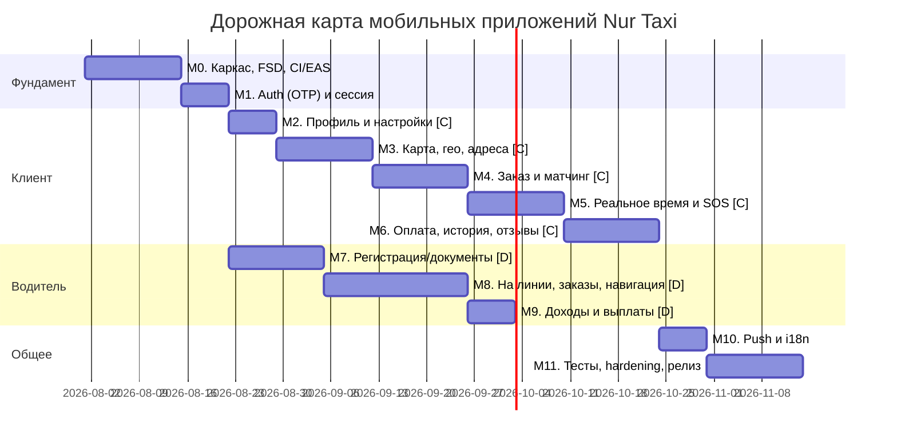

# План реализации мобильных приложений (Mobile Tasks) — Nur Taxi

> Детальный план разработки мобильных приложений **клиента** и **водителя** для платформы
> «Женское такси» (Nur Taxi). Реализует функциональные требования `requirements.md` и
> технические решения `design.md` применительно к мобильному клиенту.
>
> - **Стек:** Expo (React Native) + TypeScript + Redux Toolkit (RTK Query) + FSD.
> - **Платформы:** Android и iOS (одна кодовая база).
> - **Версия:** 1.0
> - **Дата:** 23 июля 2026
> - **Цель MVP:** запуск в одном регионе (Республика Ингушетия), клиентское и водительское
>   приложения, интеграция с backend API (`requirements.md §14`) и WebSocket (`§15`).

---

## 0. Важные оговорки и решения

1. **Отклонение от `design.md §3`.** В `design.md` для мобильных приложений рекомендован
   Flutter. По требованию заказчика мобильная часть реализуется на **Expo React Native +
   Redux Toolkit + FSD**. Это допустимо: `requirements.md §17` и `design.md §3` явно
   разрешают эквивалентные замены при соблюдении принципов. Все серверные контракты (REST
   `§14`, WebSocket `§15`, событийная модель) остаются без изменений.
2. **Два приложения.** `requirements.md §6.1` требует отдельные приложения клиента (п.1) и
   водителя (п.2). Оба входят в scope MVP (`§5`), поэтому план покрывает **оба** приложения
   в едином монорепозитории с общими переиспользуемыми слоями.
3. **Архитектура — Feature-Sliced Design (FSD).** В контексте React Native слой `pages`
   именуется `screens`. Итоговые слои: `app → processes → screens → widgets → features →
   entities → shared`.
4. **Expo Dev Client, не Expo Go.** Из-за нативных зависимостей (карты, геолокация в фоне,
   push, secure storage) используется **EAS Build + Expo Dev Client** и `expo prebuild`
   (Continuous Native Generation), а не Expo Go.

---

## Условные обозначения
- **Приоритет:** P0 (блокирующий MVP), P1 (важно для MVP), P2 (после MVP).
- **Req:** ссылка на раздел `requirements.md`. **Des:** ссылка на `design.md`.
- **API:** соответствующий endpoint из `requirements.md §14`.
- **DoD:** Definition of Done — критерий завершённости.
- **[C]** — касается приложения клиента, **[D]** — приложения водителя, **[C/D]** — общее.
- **Статус:** `[x]` — выполнено, `[~]` — частично (что именно осталось — в примечании), `[ ]` — не начато.

---

## Технологический стек мобильной части

| Область | Решение | Назначение |
|---------|---------|-----------|
| Платформа | **Expo SDK (latest) + React Native + TypeScript** | одна кодовая база iOS/Android |
| Сборка | **EAS Build / EAS Submit / EAS Update**, `expo prebuild`, Dev Client | нативные модули, OTA-обновления |
| Навигация | **Expo Router** (тонкие route-файлы → `screens` слой FSD) | файловая маршрутизация, deep links |
| Состояние | **Redux Toolkit** (slices) | клиентское состояние (UI, сессия, заказ) |
| Серверное состояние | **RTK Query** | REST API (`§14`), кэш, инвалидция, повторы |
| Реальное время | **socket.io-client** (или ws) | статусы заказа, позиция водителя (`§15.1`) |
| Карты | **react-native-maps** (адаптер провайдера; Yandex/2ГИС/OSM за интерфейсом) | карта, маркеры, polyline |
| Геолокация | **expo-location** (+ фоновое отслеживание для водителя) | текущее местоположение, трекинг |
| Безопасное хранилище | **expo-secure-store** | JWT access/refresh (не в redux-persist) |
| Локальный кэш | **redux-persist** (AsyncStorage) для не-секретного состояния | офлайн-стейт, справочники |
| Push | **expo-notifications** (FCM/APNs) | уведомления (`§23`) |
| Формы/валидация | **react-hook-form + zod** | анкеты, регистрация |
| i18n | **i18next + react-i18next + expo-localization** | ru по умолчанию (`§24`) |
| Загрузка файлов | **expo-image-picker + expo-file-system** | документы/фото водителя (`§8.2`) |
| UI-кит | собственные компоненты в `shared/ui` (+ дизайн-токены) | единый стиль, доступность |
| Тесты | **Jest + React Native Testing Library**, **Maestro** (e2e) | unit/компонентные/сценарные |
| Качество | ESLint (+ boundaries для FSD) + Prettier + TypeScript strict | архитектурные границы |

---

## Структура монорепозитория и FSD

```
mobile/
├─ package.json                # workspaces (npm/pnpm)
├─ tsconfig.base.json
├─ packages/
│  └─ shared-core/             # переиспользуемый код клиента и водителя (FSD-lite)
│     ├─ shared/               # api base, config, lib, ui-примитивы, i18n, типы
│     ├─ entities/             # user, order, driver, tariff, region, geo, payment
│     └─ features/             # auth (OTP), геопоиск, websocket-подписки
├─ apps/
│  ├─ client/                  # приложение клиента (Expo)
│  │  ├─ app/                  # Expo Router: тонкие маршруты → screens
│  │  └─ src/
│  │     ├─ app/               # провайдеры: store, навигация, тема, i18n, error boundary
│  │     ├─ processes/         # сквозные процессы: заказ поездки, SOS, онбординг
│  │     ├─ screens/           # экраны (FSD «pages»)
│  │     ├─ widgets/           # композитные блоки экранов (карта заказа, панель водителя)
│  │     ├─ features/          # пользовательские фичи (создать заказ, отменить, оценить)
│  │     ├─ entities/          # клиентские сущности (адрес, семья, промокод)
│  │     └─ shared/            # локальные ui/lib/config клиента
│  └─ driver/                  # приложение водителя (Expo), та же структура FSD
```

**Правила слоёв (ESLint boundaries):** импорт разрешён только «вниз» по слоям
(`app → processes → screens → widgets → features → entities → shared`). Кросс-импорт внутри
одного слоя между слайсами запрещён; публичный API слайса — только через `index.ts`.

---

## Дорожная карта (обзор фаз)



---

## Текущий статус реализации (на 26 июля 2026)

Сделан **фундамент обоих приложений**: монорепозиторий поднят, общий пакет `shared-core`
покрывает весь контракт бэкенда, у клиента и водителя есть слой `app`, навигация и маршруты.
Разработка экранов разделена: клиентское приложение делает один разработчик, водительское — второй.

| Что | Состояние |
|-----|-----------|
| Монорепозиторий `mobile/` (workspaces, ESLint с границами FSD, Prettier, pre-commit) | готово |
| `shared-core`: конфигурация, `baseApi` с refresh и идемпотентностью, **все** эндпоинты `§14`, типы и enum'ы, i18n, UI-кит, WebSocket-слой, геолокация | готово |
| Клиент: слой `app`, процесс заказа, виджет карты, экраны входа и главный экран | готово |
| Клиент: профиль, настройки, экстренные контакты, способы оплаты | готово |
| Клиент: поиск адресов, выбор на карте, любимые адреса | готово |
| Клиент: оформление заказа, экран поездки, отмена | готово |
| Клиент: история, оплата, отзывы | готово (привязка карты — M6.1, отложено) |
| Клиент: push, in-app уведомления, семейный аккаунт | готово (избранные водители — M10.5, отложено) |
| Водитель: слой `app`, процесс смены, guard верификации, маршруты | заглушки, экранов нет |
| Проверки `npm run typecheck`, `npx eslint .`, `npm test` | проходят чисто |
| CI мобильного трека, сборка в EAS, тесты, документация | не сделано |

Каждый маршрут-заглушка содержит номер задачи из этого плана, список нужных эндпоинтов и
подсказку, какие готовые хуки и хелперы из `shared-core` использовать, — экран пишется на месте
заглушки без поиска по документации.

**Ближайшие шаги:** hardening (M11) → mobile CI (M0.12).

---

## Фаза M0. Каркас, FSD-инфраструктура, CI/EAS (P0)
Цель: работоспособный «скелет» обоих приложений на устройстве до бизнес-логики.
Des §3, §14 · Req §5, §10.4

> **Статус: почти завершена.** Каркас, конфигурация, UI-кит, i18n и наблюдаемость готовы в
> обоих приложениях. Осталось: сборка на устройствах, привязка проекта EAS и CI.

- [x] **M0.1** [C/D] Инициализация монорепо (workspaces), два Expo-приложения `client`/`driver`, общий `shared-core`.
- [x] **M0.2** [C/D] TypeScript strict, ESLint + Prettier + правила границ FSD (eslint-plugin-boundaries), pre-commit хуки.
- [x] **M0.3** [C/D] Настройка Expo Router (тонкие маршруты, делегирующие в слой `screens`), базовая навигация (стек + табы).
- [x] **M0.4** [C/D] Redux Toolkit store: конфигурация, типизированные хуки (`useAppDispatch/useAppSelector`), redux-persist (не-секретное состояние).
- [x] **M0.5** [C/D] RTK Query `baseApi`: `baseUrl` из env (`/api/v1`), `prepareHeaders` (Bearer), заголовок `Idempotency-Key` для мутаций (`§14.5`).
- [x] **M0.6** [C/D] `shared/config`: окружения dev/staging/prod через `app.config.ts` + `EXPO_PUBLIC_*`.
- [x] **M0.7** [C/D] Дизайн-система в `shared/ui`: токены (цвета/типографика/отступы), базовые компоненты (Button, Input, Text, Screen, Sheet), тема (в т.ч. учёт культурных особенностей региона).
- [x] **M0.8** [C/D] i18n-каркас (i18next), ru по умолчанию, структура словарей, определение локали устройства. — *Req §24*
- [x] **M0.9** [C/D] Обработка ошибок: global ErrorBoundary, Sentry (`@sentry/react-native`), единый формат ошибок API (`code/message/details`). — *Des §13*
- [~] **M0.10** [C/D] `expo prebuild` + Dev Client; проверка запуска на реальном Android и iOS. — *конфигурация и плагины готовы, `expo config` проходит; запуск на живых устройствах не выполнен*
- [~] **M0.11** [C/D] EAS Build профили (development/preview/production), EAS Update (OTA), базовый `eas.json`. — *`eas.json` готов в обоих приложениях; проект клиента привязан к EAS, водительский — нет (нужен свой `EAS_PROJECT_ID`)*
- [ ] **M0.12** [C/D] CI (GitHub Actions): lint → typecheck → тесты → EAS build (preview). — *Req §26. Существующий `.github/workflows/ci.yml` покрывает только сервер*
- **DoD:** оба приложения собираются в EAS, запускаются на Android и iOS, показывают стартовый экран, ходят в `/api/v1` (health), логируют ошибки в Sentry.

---

## Фаза M1. Аутентификация (OTP) и сессия (P0)
Общий модуль в `shared-core/features/auth`. Req §8.1, §7 · Des §9 · API §14.1

> **Статус: логика готова целиком** (`shared-core/features/auth`, `entities/session`), экраны
> реализованы в приложении клиента. У водителя те же хуки подключены, но экраны — заглушки.

- [x] **M1.1** [C/D] Entity `session`: slice (tokens в SecureStore, статус авторизации, роль пользователя).
- [~] **M1.2** [C/D] Экран ввода телефона → `POST /auth/otp/request`; маска/валидация номера (zod). — *API §14.1. Клиент готов; у водителя маршрут-заглушка*
- [~] **M1.3** [C/D] Экран ввода кода → `POST /auth/otp/verify`; таймер повторной отправки, лимиты/анти-перебор на UI. — *Req §20, Des §9. Клиент готов; у водителя маршрут-заглушка*
- [x] **M1.4** [C/D] Хранение JWT в `expo-secure-store`; автоподстановка Bearer в RTK Query.
- [x] **M1.5** [C/D] Тихое обновление токена: перехват `401` в `baseQuery` → `POST /auth/refresh` (с ротацией) → повтор запроса; при неудаче — logout. — *Des §9, API §14.1*
- [x] **M1.6** [C/D] Logout (`POST /auth/logout`), очистка SecureStore и redux-persist.
- [x] **M1.7** [C] Онбординг после первой регистрации: запрос имени, опц. фото, **согласие на обработку ПДн (152-ФЗ)**. — *Req §8.1, §8.3, Des §9*
- [x] **M1.8** [C/D] Guard-навигация: разделение стеков «гость / авторизован»; для водителя — учёт статуса верификации.
- **DoD:** клиент регистрируется < 60 сек (`§10.1`); токены сохраняются и обновляются; после перезапуска сессия восстанавливается.

---

## Фаза M2. Профиль и настройки клиента [C] (P0)
Req §8.3 · API §14.2

> **Статус: экраны реализованы.** Профиль, редактирование, настройки уведомлений/приватности,
> экстренные контакты и список способов оплаты готовы. Загрузка фото профиля — после presign
> на сервере (как в онбординге).

- [x] **M2.1** [C] Entity `user`: RTK Query `GET/PATCH /me`, кэш профиля.
- [x] **M2.2** [C] Экран профиля: фото (upload), имя, телефон, язык интерфейса. — *Req §8.3, §24. Отображение и редактирование имени/языка готовы; upload фото — после presign*
- [x] **M2.3** [C] Настройки уведомлений и приватности. — *Req §8.3*
- [x] **M2.4** [C] Экстренные контакты: список + CRUD, лимит 5 (`GET/POST/DELETE /me/emergency-contacts`). — *Req §8.7, API §14.2*
- [x] **M2.5** [C] Способы оплаты (список; привязка — вместе с Фазой M6). — *Req §8.3*
- [x] **M2.6** [C] Переключение языка интерфейса на лету (i18n). — *Req §24*
- **DoD:** клиент редактирует профиль и настройки; данные сохраняются на сервере и переживают перезапуск.

---

## Фаза M3. Карта, геолокация, поиск и любимые адреса [C] (P0)
Req §8.5, §8.8, §8.9 · Des §7 · API §14.2

> **Статус: завершена.** Поиск, выбор на карте, CRUD любимых адресов и быстрый выбор
> избранного реализованы. Reverse-geocoding на сервере пока недоступен — при выборе на карте
> показываются координаты.

- [x] **M3.1** [C] Разрешения геолокации (foreground) через expo-location; UX-обработка отказа. — *Req §8.8*
- [x] **M3.2** [C/D] Widget карты с абстракцией провайдера (Yandex MapKit, `design.md §4.3`): маркеры, центрирование, polyline.
- [x] **M3.3** [C] Главный экран клиента: карта, «моё местоположение», поле поиска, кнопка заказа, меню профиля. — *Req §8.8*
- [x] **M3.4** [C] Поиск адресов `GET /geo/search?q=` с debounce, учётом специфики адресации СК; результаты списком. — *Req §8.9, API §14.2*
- [x] **M3.5** [C] Выбор точки на карте (pickup/dropoff). — *Req §8.10. Reverse-geocoding — после эндпоинта на сервере; сейчас координаты*
- [x] **M3.6** [C] Entity `savedAddress`: любимые адреса (Дом/Работа/…), CRUD, без лимита (`GET/POST/DELETE /me/addresses`). — *Req §8.5, API §14.2*
- [x] **M3.7** [C] Быстрый выбор сохранённого адреса как пункта назначения/отправления.
- **DoD:** клиент видит себя на карте, находит адрес, сохраняет/выбирает любимые адреса.

---

## Фаза M4. Оформление заказа и матчинг [C] (P0)
Сквозной процесс `processes/order-flow`. Req §8.10–8.12, §12 · Des §5, §6 · API §14.2

> **Статус: экраны реализованы.** Оформление заказа, поиск водителя, карточка водителя,
> стадии поездки, отмена, блокировка второго заказа и fallback-поллинг готовы.

- [x] **M4.1** [C] Entity `tariff`/`order`: типы, маппинг статусов конечного автомата (`§12.1`).
- [x] **M4.2** [C] Расчёт стоимости/маршрута `POST /orders/estimate` (цена до заказа); карточка с ETA, дистанцией, ценой. — *Req §8.10, Des §7, API §14.2*
- [x] **M4.3** [C] Выбор тарифа, способа оплаты, комментарий к заказу (`§8.11`). — *Тариф из estimate; мультивыбор — при расширении API*
- [x] **M4.4** [C] Подтверждение и создание заказа `POST /orders` с `Idempotency-Key`. — *Req §8.10, §14.5*
- [x] **M4.5** [C] Экран поиска водителя (`SEARCHING_DRIVER`); обработка `NO_DRIVERS_FOUND`. — *Req §12, §16 UC-1*
- [x] **M4.6** [C] Отображение назначенного водителя и авто на карте: карточка водителя, звонок. — *Req §8.10*
- [x] **M4.7** [C] Экраны стадий поездки (`IN_PROGRESS`, `COMPLETED`) на основе статусов заказа. — *Req §12*
- [x] **M4.8** [C] Отмена заказа `POST /orders/{id}/cancel` на разрешённых стадиях. — *Req §8.12, API §14.2*
- [x] **M4.9** [C] Блокировка нового заказа при активном (бизнес-правило `§9`). — *Req §9*
- [x] **M4.10** [C] Синхронизация статуса заказа: fallback-поллинг до подключения WS. — *API §14.2*
- **DoD:** сквозной сценарий UC-1 на staging: от estimate до назначения водителя; отмена корректно применяет политику.

---

## Фаза M5. Реальное время, отслеживание, SOS [C] (P0/P1)
Общий модуль `shared-core/features/realtime`. Req §8.7, §15 · Des §10 · API §14.2

> **Статус: транспорт готов.** `shared-core/features/realtime` — клиент Socket.IO, срез
> состояния и хуки подписки; обновление кэша RTK Query через `updateQueryData` уже работает.
> Осталась визуальная часть: движение авто на карте, SOS и совместное отслеживание.

- [x] **M5.1** [C/D] WebSocket-клиент: подключение с JWT, реконнект/бэкофф, подписка на каналы `client:{id}` / `order:{id}` (`§15.1`). — *Des §10*
- [~] **M5.2** [C] Онлайн-обновление статуса заказа и позиции водителя на карте (без поллинга). — *Req §15.1. Маркер водителя на экране поездки; плавная анимация — доработка*
- [~] **M5.3** [C] Кнопка **SOS** во время поездки → `POST /orders/{id}/sos`; подтверждение, индикация активации. — *Req §8.7. Кнопка на экране поездки готова*
- [ ] **M5.4** [C] Экран совместного отслеживания (для получателя ссылки): маршрут, координаты, данные водителя/авто, статус. — *Req §8.7, §15.1, Des §10*
- [x] **M5.5** [C/D] Обработка обрыва сети: индикатор офлайна, буферизация, восстановление подписок. — *Des §11. NetInfo + глобальный баннер, RTK `refetchOnReconnect`, восстановление WS и комнат заказов*
- **DoD:** клиент видит движение авто в реальном времени; SOS доставляет данные контактам; переподключение WS бесшовно.

---

## Фаза M6. Оплата, история поездок, отзывы [C] (P0/P1)
Req §8.13, §8.14, §22 · Des §8 · API §14.2

> **Статус: экраны готовы** (история, детали поездки, чек, отзыв, промокоды, обработка
> `FAILED_PAYMENT`). Привязка карты через SDK провайдера (M6.1) отложена до интеграции платёжного адаптера.

- [ ] **M6.1** [C] Entity `payment`: способы оплаты, привязка карты через SDK провайдера (за адаптером). — *Req §8.3, Des §4.3*
- [x] **M6.2** [C] Оплата поездки при `COMPLETED`; обработка `FAILED_PAYMENT` и retry-статуса от сервера. — *Req §12, §22, Des §8.2*
- [x] **M6.3** [C] Экран чека/квитанции после `CLOSED`. — *Req §8.13, §22*
- [x] **M6.4** [C] История поездок `GET /orders/history` (cursor-пагинация `§14.5`): дата, маршрут, цена, водитель, статус, чек. — *Req §8.13, API §14.2*
- [x] **M6.5** [C] Экран деталей поездки из истории.
- [x] **M6.6** [C] Отзыв `POST /orders/{id}/review`: оценка 1–5, текст, теги (вежливость/чистота/вождение), жалоба. — *Req §8.14, API §14.2*
- [x] **M6.7** [C] Бонусный баланс и промокоды (за feature-флагом региона). — *Req §8.3, Des §4.2*
- **DoD:** оплата проходит, чек доступен, история отображается с пагинацией, отзыв отправляется.

---

## Фаза M7. Приложение водителя: регистрация и верификация [D] (P0)
Req §8.2, §8.4, §12.3 · Des §9 · API §14.3

> **Статус: подготовлен фундамент, экраны за разработчиком приложения водителя.**
> Готово: все эндпоинты (`entities/driver`), схема валидации анкеты, хелперы верификации
> (`missingDocumentTypes`, `canSubmitForReview`), guard, маршруты-заглушки с указанием задач.

- [~] **M7.1** [D] Анкета водителя (ФИО, дата рождения, телефон, адрес, стаж, регион) → `POST /driver/register`; валидация zod. — *Req §8.2, API §14.3. Мутация и `driverRegistrationFormSchema` готовы, экран — заглушка*
- [~] **M7.2** [D] Загрузка документов (паспорт, ВУ, СТС, ОСАГО, фото авто/салона, селфи) `POST /driver/documents`; camera/gallery, сжатие, приватная загрузка. — *Req §8.2, Des §9, API §14.3. Двухшаговая загрузка (presign → S3 → регистрация ключа) готова в API-слое, экрана нет*
- [~] **M7.3** [D] Экран статуса верификации (`PENDING/REJECTED/APPROVED`), причины отклонения, повторная подача. — *Req §8.2, §12.3. Маршрут и хелперы статусов готовы, экран — заглушка*
- [x] **M7.4** [D] Блокировка выхода «на линию» и приёма заказов до одобрения. — *Req §8.2, §12.3. Реализовано в guard-навигации: без `approved` приложение не выпускает из группы `(verification)`*
- [ ] **M7.5** [D] Профиль водителя: фото, рейтинг, число поездок, сведения об авто, график. — *Req §8.4*
- **DoD:** водитель проходит регистрацию < 10 мин (`§10.1`); без верификации не может на линию.

---

## Фаза M8. Приложение водителя: линия, заказы, навигация [D] (P0)
Req §8.4, §12.3, §15 · Des §6, §10 · API §14.3

> **Статус: подготовлен фундамент.** Есть эндпоинты, срез состояния смены
> (`apps/driver/src/processes/shift`), WS-клиент и маршруты-заглушки. Экраны — за разработчиком
> приложения водителя.

- [~] **M8.1** [D] Переключатель статуса `ONLINE/OFFLINE` → `PATCH /driver/status`. — *Req §12.3, API §14.3. Мутация и состояние смены готовы, переключателя в UI нет*
- [~] **M8.2** [D] Фоновая передача геопозиции (expo-location background task) на сервер/WS для матчинга. — *Req §15.3, Des §6. Разрешения, `expo-task-manager` и foreground service настроены в `app.config.ts`; сама фоновая задача не написана*
- [ ] **M8.3** [D] Подписка WS `driver:{id}`: входящие предложения заказов с тайм-аутом; звук/вибрация. — *Des §6, §10*
- [ ] **M8.4** [D] Принятие заказа `POST /driver/orders/{id}/accept`; отображение комментария клиента. — *Req §8.11, API §14.3*
- [ ] **M8.5** [D] Смена статусов поездки `POST /driver/orders/{id}/status` (прибыл/начал/завершил) по конечному автомату. — *Req §12, API §14.3*
- [ ] **M8.6** [D] Навигация к точке подачи/назначения (маршрут на карте + deep-link во внешние карты). — *Req §8.10*
- [ ] **M8.7** [D] Отмена водителем на разрешённых стадиях (`CANCELLED_BY_DRIVER`). — *Req §8.12, §12.2*
- [ ] **M8.8** [D] Оценка клиента после поездки. — *Req §8.14*
- **DoD:** сквозной сценарий водителя: приём → подача → поездка → завершение; позиция транслируется клиенту.

---

## Фаза M9. Доходы и выплаты водителя [D] (P1)
Req §8.4, §22 · Des §8 · API §14.3

> **Статус: готов слой данных** (`driverEarnings`, `requestPayout`, `getPayouts`), экранов нет.

- [ ] **M9.1** [D] Экран доходов (день/неделя/месяц) `GET /driver/earnings`. — *Req §8.4, API §14.3*
- [ ] **M9.2** [D] Запрос вывода средств `POST /driver/payouts`; история и статусы выплат. — *Req §22, API §14.3*
- [ ] **M9.3** [D] Детализация по поездкам (комиссия, итог).
- **DoD:** водитель видит доходы за периоды и оформляет вывод средств.

---

## Фаза M10. Уведомления, i18n, семейный аккаунт (P1)
Req §8.6, §23, §24 · Des §10 · API §14.2

> **Статус: клиент готов** — push-регистрация, deep-link обработка, центр уведомлений,
> семейный аккаунт. На сервере добавлен `POST/DELETE /me/push-tokens` (нужна миграция);
> доставка push через `StubPushProvider` до интеграции FCM/APNs.

- [x] **M10.1** [C/D] Push через `expo-notifications`: регистрация токена на сервере, каналы Android, разрешения iOS. — *Req §23*
- [x] **M10.2** [C/D] Обработка push по ключевым событиям (`§23`): назначение, прибытие, завершение, оплата, верификация, SOS, промо; deep-link в нужный экран.
- [x] **M10.3** [C/D] In-app уведомления и центр уведомлений. — *Req §23*
- [x] **M10.4** [C] Семейный аккаунт: добавление/подтверждение членов семьи (`GET/POST/DELETE /me/family`), заказ и оплата поездки за члена семьи, совместное отслеживание. — *Req §8.6, §16 UC-4, API §14.2. Экран управления готов; заказ за члена семьи — в M4+*
- [ ] **M10.5** [C] Избранные водители (влияет на матчинг). — *Req §15.3*
- [~] **M10.6** [C/D] Полная локализация всех строк; i18n-ready для добавления языков. — *Req §24. Словарь ru заполнен, en — частично*
- **DoD:** пользователь получает push по всем ключевым событиям; работает заказ для члена семьи.

---

## Фаза M11. Тестирование, hardening, релиз (P0)
Req §5, §10.1, §10.4, §25 · Des §13

> **Статус: инфраструктура тестов настроена** (Jest + jest-expo + RNTL, общие моки нативных
> модулей в `jest.setup.ts` обоих приложений), самих тестов ещё нет.

- [ ] **M11.1** [C/D] Unit-тесты (Jest): slices, RTK Query-логика, утилиты, конечный автомат заказа. — *Req §25*
- [ ] **M11.2** [C/D] Компонентные тесты (React Native Testing Library) ключевых экранов/виджетов. — *Req §25*
- [ ] **M11.3** [C/D] E2E (Maestro): UC-1 (заказ), UC-2 (регистрация водителя), UC-3 (SOS), UC-4 (семья). — *Req §16, §25*
- [ ] **M11.4** [C/D] Производительность: время отклика UI, оптимизация ре-рендеров, отзывчивость без сети (`§10.1`). — *Req §10.1*
- [ ] **M11.5** [C/D] Доступность (a11y), поддержка разных размеров экранов, тёмная тема (опц.).
- [~] **M11.6** [C/D] Безопасность клиента: токены только в SecureStore, отсутствие ПДн в логах, certificate pinning (опц.), обфускация. — *Req §20, Des §9. Токены в SecureStore и вычистка ПДн из отчётов Sentry сделаны; pinning и обфускация — нет*
- [ ] **M11.7** [C/D] Подготовка сторов: иконки, сплэши, скриншоты, тексты, политика конфиденциальности; permissions rationale. — *Req §5*
- [ ] **M11.8** [C/D] EAS Submit → внутреннее тестирование (TestFlight / Google Play Internal), пилот в Ингушетии. — *Req §5, tasks.md 10.5*
- [ ] **M11.9** [C/D] Пострелизный мониторинг (Sentry, метрики), сбор обратной связи, стабилизация. — *Des §13*
- **DoD (Mobile MVP):** оба приложения опубликованы во внутренние треки Android/iOS; пройдены UC-1…UC-4; выполнены целевые KPI по времени регистрации/заказа (`§10.1`).

---

## Соответствие API → RTK Query (сводка)

| RTK Query endpoint | HTTP | Backend (`§14`) | Приложение |
|--------------------|------|-----------------|-----------|
| `requestOtp` / `verifyOtp` / `refresh` / `logout` | POST | `/auth/*` | C/D |
| `getMe` / `updateMe` | GET/PATCH | `/me` | C/D |
| `addresses` (list/add/remove) | GET/POST/DELETE | `/me/addresses` | C |
| `emergencyContacts` | GET/POST/DELETE | `/me/emergency-contacts` | C |
| `family` | GET/POST/DELETE | `/me/family` | C |
| `geoSearch` | GET | `/geo/search` | C |
| `estimateOrder` | POST | `/orders/estimate` | C |
| `createOrder` | POST | `/orders` | C |
| `getOrder` | GET | `/orders/{id}` | C |
| `cancelOrder` | POST | `/orders/{id}/cancel` | C |
| `activateSos` | POST | `/orders/{id}/sos` | C |
| `reviewOrder` | POST | `/orders/{id}/review` | C |
| `ordersHistory` | GET | `/orders/history` | C |
| `driverRegister` | POST | `/driver/register` | D |
| `driverDocuments` | POST | `/driver/documents` | D |
| `driverStatus` | PATCH | `/driver/status` | D |
| `acceptOrder` | POST | `/driver/orders/{id}/accept` | D |
| `driverOrderStatus` | POST | `/driver/orders/{id}/status` | D |
| `driverEarnings` | GET | `/driver/earnings` | D |
| `driverPayouts` | POST | `/driver/payouts` | D |

Real-time поверх RTK Query — через WebSocket-слой (`shared-core/features/realtime`) с
`updateQueryData` для инкрементального обновления кэша заказа/позиции (`§15.1`).

---

## Матрица зависимостей (критический путь)

```
M0 → M1
      ├─► [C]  M2 → M3 → M4 → M5 → M6 ─┐
      └─► [D]  M7 → M8 → M9 ───────────┤
                                       ├─► M10 → M11 (Mobile MVP)
```

---

## Сводка соответствия фаз требованиям

| Фаза | Основные требования |
|------|---------------------|
| M0 | §5, §6.1, §10.4, §26 |
| M1 | §7, §8.1, §20, §24 (Des §9) |
| M2 | §8.3, §8.7 |
| M3 | §8.5, §8.8, §8.9 (Des §7) |
| M4 | §8.10–8.12, §9, §12 (Des §5, §6) |
| M5 | §8.7, §15 (Des §10) |
| M6 | §8.13, §8.14, §22 (Des §8) |
| M7 | §8.2, §8.4, §12.3 (Des §9) |
| M8 | §8.4, §12, §15 (Des §6, §10) |
| M9 | §8.4, §22 (Des §8) |
| M10 | §8.6, §23, §24 |
| M11 | §5, §10.1, §16, §25 |

---

## Пострелизные направления (P2)
- Масштабирование на регионы этапа 2 — только через конфиг/feature-флаги, без изменения приложения. — *Req §4, §24*
- Дополнительные языки интерфейса (i18n уже готов). — *Req §24*
- Новые типы услуг (доставка документов, корпоративные/междугородние поездки, предзаказ) как отдельные фичи FSD без переработки ядра. — *Req §11, §9 п.6*
- Офлайн-режим и оптимистичные обновления для слабой сети СК.
- Автоверификация документов (клиентская интеграция с OCR-хуком сервера). — *Req §8.2*
