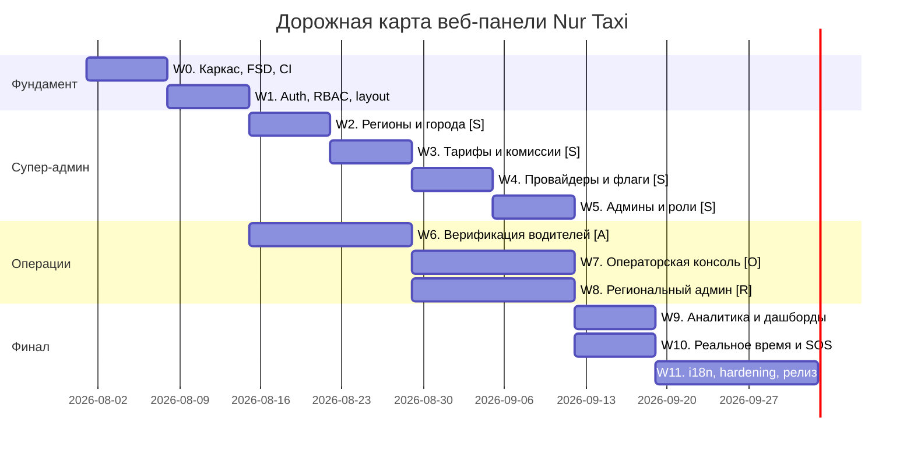

# План реализации веб-панели (Web Tasks) — Nur Taxi

> Детальный план разработки **веб-панелей** платформы «Женское такси» (Nur Taxi) для
> ролей **супер-администратор** и **оператор** (а также **региональный администратор** —
> в рамках общей RBAC-модели). Реализует функциональные требования `requirements.md`
> (§7.3–7.5, §6.3) и технические решения `design.md` (§4, §9) поверх admin-API
> (`requirements.md §14.4`).
>
> - **Стек:** React + TypeScript + Vite + Redux Toolkit (RTK Query) + FSD.
> - **Платформа:** веб (SPA), десктоп-first, адаптивно.
> - **Версия:** 1.0
> - **Дата:** 23 июля 2026
> - **Цель MVP:** запуск в одном регионе (Ингушетия) — заведение региона/города/тарифов
>   без деплоя кода (`tasks.md` Фаза 7 DoD), операторская консоль и верификация водителей.

---

## 0. Важные оговорки и решения

1. **Соответствие `design.md §3`.** Для админ-панелей рекомендован **React + TypeScript** —
   план следует этой рекомендации. Для единообразия с мобильной частью используется тот же
   **Redux Toolkit / RTK Query** и **FSD**.
2. **Одно приложение, роли через RBAC.** `requirements.md §6.1` перечисляет веб-панель
   администратора (п.3) и супер-администратора (п.4). Реализуем **единый SPA** с
   разграничением доступа по ролям (`super_admin`, `regional_admin`, `operator`) — состав
   меню и разрешённые действия определяются ролью и `region_id` (`§7.4`, `design.md §9`).
3. **Изоляция регионов.** Региональный администратор и оператор видят данные только своего
   `region_id` (row-level фильтрация на бэкенде + скрытие/блокировка на UI). — *Req §7.4, §20, Des §9*
4. **Аутентификация.** Вход по тому же механизму OTP + JWT (`§14.1`); доступ в панель
   разрешается только пользователям с админ-ролями (guard по роли после verify).
5. **Backend готов.** Согласно `tasks.md` (Фаза 7) admin-API реализовано; веб-UI — отдельный
   трек, который закрывает пункт «веб-UI — отдельный трек» из серверных задач 7.1, 2.4, 7.5.

---

## Условные обозначения
- **Приоритет:** P0 (блокирующий MVP), P1 (важно для MVP), P2 (после MVP).
- **Req:** ссылка на `requirements.md`. **Des:** ссылка на `design.md`. **API:** endpoint `§14.4`.
- **DoD:** Definition of Done — критерий завершённости.
- Роли: **[S]** супер-админ, **[O]** оператор, **[R]** региональный админ, **[A]** все админ-роли.

---

## Технологический стек веб-части

| Область | Решение | Назначение |
|---------|---------|-----------|
| Каркас | **React + TypeScript + Vite** | SPA, быстрая сборка/HMR |
| Состояние | **Redux Toolkit** (slices) | UI-состояние, сессия, фильтры |
| Серверное состояние | **RTK Query** | admin-API (`§14.4`), кэш, инвалидция, пагинация |
| Маршрутизация | **React Router** | приватные маршруты, RBAC-guard, deep-links |
| UI-кит | **Ant Design** (таблицы/формы/RBAC-layout) | admin-CRUD, дата-гриды, модалки *(альтернатива — MUI)* |
| Формы/валидация | **react-hook-form + zod** | тарифы, регионы, провайдеры |
| Графики | **Recharts / Ant Design Charts** | дашборды KPI (`§21`) |
| Карты | **MapLibre GL / Leaflet** (адаптер провайдера) | мониторинг заказов, ручное назначение |
| Реальное время | **socket.io-client** | лайв-заказы, SOS-алёрты оператору (`§15`) |
| i18n | **i18next + react-i18next** | ru по умолчанию (`§24`) |
| Безопасность | JWT в памяти + refresh, CSP, без ПДн в логах | `§20`, Des §9 |
| Тесты | **Vitest + React Testing Library**, **Playwright** (e2e) | unit/компонентные/сценарные |
| Качество | ESLint (+ boundaries FSD) + Prettier + TS strict | архитектурные границы |
| Деплой | **Docker + Nginx**, CI/CD (`design.md §14`) | статика за реверс-прокси |

---

## Структура проекта и FSD

```
web-admin/
├─ package.json
├─ vite.config.ts
├─ index.html
└─ src/
   ├─ app/         # провайдеры: store, router, тема AntD, i18n, RBAC-guard, ErrorBoundary
   ├─ processes/   # сквозные процессы: онбординг региона, разбор обращения, разрешение спора
   ├─ pages/       # страницы-роуты (Dashboard, Regions, Tariffs, Orders, Drivers, ...)
   ├─ widgets/     # композитные блоки (таблица заказов, карта мониторинга, панель фильтров)
   ├─ features/    # действия (создать регион, назначить водителя, оформить возврат, верифицировать)
   ├─ entities/    # доменные модели (region, city, tariff, provider, order, driver, user, review)
   └─ shared/      # api base, config, ui-обёртки AntD, lib, rbac, i18n, типы
```

**Правила слоёв (ESLint boundaries):** импорт только «вниз» (`app → processes → pages →
widgets → features → entities → shared`); публичный API слайса — через `index.ts`.

---

## Дорожная карта (обзор фаз)



---

## Фаза W0. Каркас, FSD-инфраструктура, CI (P0)
Des §3, §14 · Req §26

- [ ] **W0.1** [A] Инициализация проекта Vite + React + TS, структура каталогов FSD.
- [ ] **W0.2** [A] ESLint + Prettier + правила границ FSD (eslint-plugin-boundaries), TS strict, pre-commit хуки.
- [ ] **W0.3** [A] Redux Toolkit store + типизированные хуки; RTK Query `baseApi` (`baseUrl=/api/v1`, `prepareHeaders` Bearer, `Idempotency-Key` для мутаций `§14.5`).
- [ ] **W0.4** [A] React Router: публичные/приватные маршруты, layout-скелет.
- [ ] **W0.5** [A] Подключение Ant Design (тема, токены), базовые обёртки в `shared/ui`.
- [ ] **W0.6** [A] i18n-каркас (i18next), ru по умолчанию. — *Req §24*
- [ ] **W0.7** [A] Обработка ошибок: ErrorBoundary, Sentry, единый формат ошибок API (`code/message/details`). — *Des §13*
- [ ] **W0.8** [A] `shared/config`: окружения dev/staging/prod через `.env` (`VITE_*`).
- [ ] **W0.9** [A] Dockerfile + Nginx (SPA fallback), CI: lint → typecheck → тесты → build → образ. — *Req §26, Des §14*
- **DoD:** приложение собирается, деплоится как статика за Nginx, ходит в `/api/v1`, логирует ошибки в Sentry.

---

## Фаза W1. Аутентификация, RBAC, layout (P0)
Req §7 · Des §9 · API §14.1

- [ ] **W1.1** [A] Экран входа: телефон → `POST /auth/otp/request`, код → `POST /auth/otp/verify`. — *API §14.1*
- [ ] **W1.2** [A] Хранение JWT (access — в памяти, refresh — httpOnly/secure по возможности), тихий refresh на `401` → `POST /auth/refresh`; logout. — *Des §9*
- [ ] **W1.3** [A] Guard по роли: доступ в панель только для `super_admin`/`regional_admin`/`operator`; отказ остальным.
- [ ] **W1.4** [A] RBAC-механизм: матрица «роль → разрешения», компоненты `<Can>`/`useCan`, скрытие пунктов меню и действий. — *Req §7, Des §9*
- [ ] **W1.5** [A] Основной layout: боковое меню (зависит от роли), шапка (профиль, регион, выход), контентная область.
- [ ] **W1.6** [R][O] Контекст региона: для region-scoped ролей `region_id` фиксирован; для супер-админа — переключатель региона. — *Req §7.4, Des §9*
- **DoD:** админ входит по OTP, видит меню согласно роли; region-scoped роли ограничены своим регионом.

---

## Фаза W2. Супер-админ: регионы и города [S] (P0)
Req §7.5, §6.3 · Des §4 · API §14.4

- [ ] **W2.1** [S] Entity `region`/`city`: RTK Query CRUD `GET/POST/PATCH/DELETE /admin/regions`, `/admin/cities`. — *API §14.4*
- [ ] **W2.2** [S] Список регионов (таблица, поиск, статус активности), детальная карточка.
- [ ] **W2.3** [S] Создание/редактирование региона: `name`, `currency`, `timezone`, `is_active`. — *Req §6.3, §24, Des §4.1*
- [ ] **W2.4** [S] Управление городами региона: `name`, границы (`boundaries`) на карте. — *Req §13.5*
- [ ] **W2.5** [S] Назначение регионального администратора региону. — *Req §7.5, §16 UC-5*
- **DoD:** новый регион и город заводятся через панель без деплоя кода (`tasks.md` Фаза 7 DoD).

---

## Фаза W3. Супер-админ: тарифы и комиссии [S] (P0)
Req §22, §8.12 · Des §4.1, §7 · API §14.4

- [ ] **W3.1** [S] Entity `tariff`: CRUD `/admin/tariffs` (per-region). — *API §14.4*
- [ ] **W3.2** [S] Форма тарифа: `base_fare`, `price_per_km`, `price_per_min`, `min_price`, `commission_percent`, `surge_rules`. — *Req §22, Des §7*
- [ ] **W3.3** [S] Плановое применение через `effective_from` (немедленно/по расписанию). — *Req §9 п.5, Des §4.1*
- [ ] **W3.4** [S] Политика отмены и штрафов (`cancellation_policy`) — настройка без изменения кода. — *Req §8.12, Des §4.2*
- [ ] **W3.5** [S] История изменений тарифов и предпросмотр расчёта цены по тарифу.
- **DoD:** тариф/комиссия/политика отмены создаются и применяются через панель без деплоя.

---

## Фаза W4. Супер-админ: провайдеры и feature-флаги [S] (P0/P1)
Req §6.3 · Des §4.2, §4.3 · API §14.4

- [ ] **W4.1** [S] Entity `provider`: CRUD `/admin/providers` (type = payment/sms/maps) per-region. — *Req §6.3, API §14.4*
- [ ] **W4.2** [S] Форма провайдера: выбор реализации, `credentials_ref` (ссылка на секрет, без хранения секретов в UI), `is_active`. — *Des §4.3, §9*
- [ ] **W4.3** [S] Feature-флаги региона (`family_account`, `promo_codes`, `surge_pricing`, …): включение/отключение. — *Req §24, Des §4.2*
- [ ] **W4.4** [S] Индикация активной конфигурации провайдеров по региону; проверка соединения (health, если доступно).
- **DoD:** смена провайдера/флага по региону выполняется данными через панель, без изменения кода (`§6.3`).

---

## Фаза W5. Супер-админ: администраторы и права [S] (P1)
Req §7.5, §20 · Des §9

- [ ] **W5.1** [S] Управление пользователями-администраторами: создание, назначение роли и региона. — *Req §7.5*
- [ ] **W5.2** [S] Настройка прав (RBAC), блокировка/разблокировка админ-аккаунтов.
- [ ] **W5.3** [S] Просмотр аудит-лога действий администраторов/операторов. — *Req §20, Des §9*
- **DoD:** супер-админ создаёт региональных админов/операторов и управляет их правами; действия аудируются.

---

## Фаза W6. Верификация водителей [A] (P0)
Req §8.2 · Des §9 · API §14.4

- [ ] **W6.1** [A] Entity `driver`: `GET/PATCH /admin/drivers` (список, фильтры по статусу верификации, регион-скоуп). — *API §14.4*
- [ ] **W6.2** [A] Очередь на модерацию: анкеты и документы, просмотр по приватным подписанным URL. — *Req §8.2, Des §9*
- [ ] **W6.3** [A] Просмотр документов (паспорт, ВУ, СТС, ОСАГО, фото авто/салона, селфи) с зумом. — *Req §8.2*
- [ ] **W6.4** [A] Одобрение / отклонение с указанием причины → `PATCH /admin/drivers`. — *Req §8.2, §16 UC-2*
- [ ] **W6.5** [A] Блокировка/разблокировка водителя; отражение статуса (`PENDING/APPROVED/REJECTED/BLOCKED`). — *Req §12.3, §7.4*
- **DoD:** модератор одобряет/отклоняет водителя с причиной; неверифицированный не может на линию.

---

## Фаза W7. Операторская консоль [O] (P0)
Req §7.3 · Des §5 · API §14.4

- [ ] **W7.1** [O] Мониторинг заказов: таблица с фильтрами (статус, регион, дата), cursor-пагинация (`§14.5`). — *Req §7.3*
- [ ] **W7.2** [O] Карточка заказа: статус (конечный автомат `§12`), маршрут на карте, клиент, водитель, история статусов (`OrderStatusLog`). — *Req §12, §13.3, Des §5*
- [ ] **W7.3** [O] Изменение статуса заказа вручную (в рамках разрешённых переходов `§12.2`). — *Req §7.3, §12*
- [ ] **W7.4** [O] Ручное назначение водителя `POST /admin/orders/{id}/assign` (карта ближайших свободных). — *Req §7.3, §15.3, API §14.4*
- [ ] **W7.5** [O] Оформление возврата/компенсации `POST /admin/orders/{id}/refund`. — *Req §7.3, §22, API §14.4*
- [ ] **W7.6** [O] Работа с обращениями клиентов/водителей (тикеты/жалобы из отзывов `§8.14`). — *Req §7.3, §8.14*
- **DoD:** оператор находит заказ, меняет статус, вручную назначает водителя и оформляет возврат/компенсацию.

---

## Фаза W8. Региональный администратор [R] (P1)
Req §7.4, §20 · Des §9 · API §14.4

- [ ] **W8.1** [R] Изоляция по `region_id`: все списки/действия ограничены своим регионом. — *Req §7.4, Des §9*
- [ ] **W8.2** [R] Управление водителями региона: подтверждение документов, блокировка. — *Req §7.4*
- [ ] **W8.3** [R] Управление тарифами своего региона (в пределах прав). — *Req §7.4*
- [ ] **W8.4** [R] Просмотр региональной статистики. — *Req §7.4*
- [ ] **W8.5** [R] Работа с обращениями пользователей региона. — *Req §7.4*
- **DoD:** региональный админ работает только в своём регионе; попытки доступа к чужим данным блокируются.

---

## Фаза W9. Аналитика и дашборды (P1)
Req §21, §10.1 · Des §13 · API §14.4

- [ ] **W9.1** [A] `GET /admin/analytics`: агрегаты по региону/периоду. — *API §14.4*
- [ ] **W9.2** [A] Дашборд KPI: время назначения водителя, доля успешных заказов/платежей, доступность, латентность (`§10.1`). — *Req §10.1, Des §13*
- [ ] **W9.3** [A] Отчёты: заказы, водители, финансы; экспорт (CSV/Excel). — *Req §21*
- [ ] **W9.4** [A] Графики (Recharts) с фильтрами по региону и датам; region-скоуп для [R]/[O].
- **DoD:** дашборды отображают ключевые метрики по регионам с фильтрами и экспортом.

---

## Фаза W10. Реальное время и SOS-мониторинг (P0/P1)
Req §8.7, §15 · Des §10 · API §14.4

- [ ] **W10.1** [A] WebSocket-клиент: подключение с JWT, реконнект, подписки на служебные каналы. — *Des §10*
- [ ] **W10.2** [O] Лайв-обновление списка/карты заказов и позиций водителей без перезагрузки. — *Req §15.1*
- [ ] **W10.3** [O] **Приоритетные SOS-алёрты** оператору (событие `sos.activated`): всплывающее оповещение, координаты, данные водителя/авто, статус. — *Req §8.7, §16 UC-3, Des §9*
- [ ] **W10.4** [A] Живые уведомления о ключевых событиях (`order.*`, `payment.failed`, `document.verified`). — *Des §10*
- **DoD:** оператор видит заказы и SOS в реальном времени; SOS приходит как приоритетное оповещение.

---

## Фаза W11. i18n, безопасность, тесты, релиз (P0)
Req §20, §24, §25 · Des §9, §13, §14

- [ ] **W11.1** [A] Полная локализация интерфейса (ru), i18n-ready для новых языков. — *Req §24*
- [ ] **W11.2** [A] Security-hardening: CSP, отсутствие ПДн в логах, безопасное хранение токенов, проверка RBAC на всех маршрутах/действиях. — *Req §20, Des §9*
- [ ] **W11.3** [A] Проверка изоляции регионов (нельзя увидеть/изменить чужой `region_id`). — *Req §7.4, §25*
- [ ] **W11.4** [A] Unit/компонентные тесты (Vitest + RTL): RBAC, формы, таблицы, slices.
- [ ] **W11.5** [A] E2E (Playwright): UC-5 (управление регионом), верификация водителя, операторский разбор заказа/возврат. — *Req §16, §25*
- [ ] **W11.6** [A] Доступность (a11y), адаптивность, состояния загрузки/ошибок/пустых списков.
- [ ] **W11.7** [A] Деплой на staging → production (Docker/Nginx), CI/CD с автотестами и сканированием. — *Req §26, Des §14*
- **DoD (Web MVP):** супер-админ заводит регион/город/тариф/провайдера без деплоя; оператор ведёт заказы и возвраты; пройден UC-5 и сценарии верификации/операций.

---

## Соответствие admin-API → RTK Query (сводка)

| RTK Query endpoint | HTTP | Backend (`§14.4`) | Роль |
|--------------------|------|-------------------|------|
| `requestOtp` / `verifyOtp` / `refresh` / `logout` | POST | `/auth/*` (`§14.1`) | A |
| `regions` / `cities` (CRUD) | GET/POST/PATCH/DELETE | `/admin/regions`, `/admin/cities` | S |
| `tariffs` (CRUD) | GET/POST/PATCH/DELETE | `/admin/tariffs` | S/R |
| `providers` (CRUD) | GET/POST/PATCH/DELETE | `/admin/providers` | S |
| `drivers` (list/verify) | GET/PATCH | `/admin/drivers` | A |
| `analytics` | GET | `/admin/analytics` | A |
| `assignOrder` | POST | `/admin/orders/{id}/assign` | O |
| `refundOrder` | POST | `/admin/orders/{id}/refund` | O |

Real-time (лайв-заказы, SOS, статусы) — через WebSocket-слой с `updateQueryData` для
инкрементального обновления кэша RTK Query (`§15`).

---

## Матрица зависимостей (критический путь)

```
W0 → W1
      ├─► [S]  W2 → W3 → W4 → W5
      ├─► [A]  W6 ──► [O] W7 ──► W9
      │                    └────► W10
      └─► [R]  W8 (после W3)
W9 + W10 → W11 (Web MVP)
```

---

## Сводка соответствия фаз требованиям

| Фаза | Основные требования |
|------|---------------------|
| W0 | §6.1, §26 (Des §3, §14) |
| W1 | §7, §20 (Des §9) |
| W2 | §7.5, §6.3, §13.5 (Des §4) |
| W3 | §22, §8.12, §9 п.5 (Des §4, §7) |
| W4 | §6.3, §24 (Des §4.2, §4.3) |
| W5 | §7.5, §20 (Des §9) |
| W6 | §8.2, §12.3 (Des §9) |
| W7 | §7.3, §12, §22 (Des §5) |
| W8 | §7.4, §20 (Des §9) |
| W9 | §21, §10.1 (Des §13) |
| W10 | §8.7, §15 (Des §10) |
| W11 | §20, §24, §25 (Des §9, §13, §14) |

---

## Пострелизные направления (P2)
- Масштабирование на регионы этапа 2 — только конфигурация через панель, без изменения кода. — *Req §4, §6.3*
- Расширенная аналитика/BI-дашборды и алёртинг по KPI. — *Req §21, Des §13*
- Дополнительные языки интерфейса (i18n готов). — *Req §24*
- Управление новыми типами услуг (доставка документов, корпоративные/междугородние поездки) как отдельные разделы FSD без переработки ядра. — *Req §11, §9 п.6*
- Инструменты массовых операций и расширенный аудит/экспорт логов. — *Req §20*
