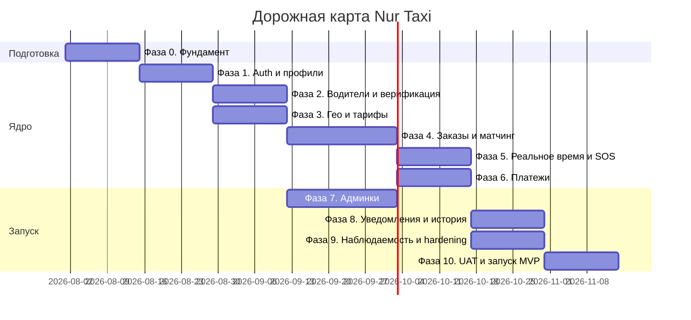

# План реализации (Tasks) — Nur Taxi

> План выполнения требований `requirements.md` согласно техническим решениям `design.md`.
> Организован по фазам: от инфраструктуры к MVP и масштабированию. Каждая задача имеет
> ссылки на требования, зависимости и критерии готовности (Definition of Done).
>
> - **Версия:** 1.0
> - **Дата:** 22 июля 2026
> - **Цель MVP:** запуск в одном регионе (Республика Ингушетия), Android + iOS.

---

## Условные обозначения
- **Приоритет:** P0 (блокирующий MVP), P1 (важно для MVP), P2 (после MVP).
- **Req:** ссылка на раздел `requirements.md`. **Des:** ссылка на `design.md`.
- **DoD:** Definition of Done — критерий завершённости.

---

## Дорожная карта (обзор фаз)



---

## Фаза 0. Фундамент и инфраструктура (P0)
Цель: репозитории, окружения, CI/CD, каркас модулей — до бизнес-логики.

- [ ] **0.1** Монорепозиторий / структура репозиториев (backend, mobile, web-admin). — *Des §3*
- [ ] **0.2** Каркас backend на NestJS с модульными границами (§2.3). — *Des §2*
- [ ] **0.3** PostgreSQL + PostGIS, Redis, S3(MinIO), NATS в docker-compose (dev). — *Des §3*
- [ ] **0.4** Инфраструктура как код: Terraform + Helm, кластер Kubernetes (staging). — *Des §14*
- [ ] **0.5** CI/CD: линт → тесты → сборка образов → сканирование → деплой. — *Req §26*
- [ ] **0.6** Система миграций БД, версионирование, автоприменение. — *Des §14*
- [ ] **0.7** Управление секретами (Vault), окружения dev/staging/prod. — *Req §26, Des §9*
- [ ] **0.8** Каркас наблюдаемости: OpenTelemetry, Prometheus, Grafana, Sentry, структурные логи. — *Des §13*
- **DoD:** «hello-world» сервис проходит CI и деплоится в staging с метриками и логами.

---

## Фаза 1. Идентичность, роли, профили (P0)
Req §7, §8.1, §8.3 · Des §9

- [ ] **1.1** Модель данных User/роли, RBAC-механизм (5 ролей). — *Req §7*
- [ ] **1.2** OTP-регистрация: `otp/request`, `otp/verify` + SMS-адаптер (интерфейс + заглушка). — *Req §8.1, Des §4.3*
- [ ] **1.3** JWT (access/refresh с ротацией), защита OTP от перебора (rate limit). — *Des §9*
- [ ] **1.4** Профиль клиента: имя, фото, язык, настройки уведомлений/приватности. — *Req §8.3*
- [ ] **1.5** Согласие на обработку ПДн (152-ФЗ), хранение факта согласия. — *Req §8.1, Des §9*
- [ ] **1.6** Мобильный флоу регистрации клиента (Flutter), цель ≤ 60 сек. — *Req §8.1, §10.1*
- **DoD:** клиент регистрируется за < 1 мин, получает токены, редактирует профиль.

---

## Фаза 2. Водители и верификация (P0)
Req §8.2, §8.4 · Des §9

- [ ] **2.1** DriverProfile, Vehicle, DriverDocument; статусы верификации. — *Req §13.1*
- [ ] **2.2** Анкета водителя (обязательные поля §8.2, этап 2). — *Req §8.2*
- [ ] **2.3** Загрузка документов в приватный S3, подписанные URL. — *Req §8.2, Des §9*
- [ ] **2.4** Ручная модерация документов (интерфейс оператора/админа). — *Req §8.2*
- [ ] **2.5** Блокировка приёма заказов до верификации; статусы «на линии/офлайн». — *Req §8.2, §12.3*
- [ ] **2.6** Профиль водителя: рейтинг, поездки, доходы, статус, авто, график. — *Req §8.4*
- [ ] **2.7** (P2) Хук под будущий OCR+AI автоверификации (интерфейс). — *Req §8.2*
- **DoD:** водитель проходит регистрацию < 10 мин; без верификации не может на линию.

---

## Фаза 3. Гео, поиск адресов, тарифы, регионы (P0)
Req §8.9, §8.5, §6.3 · Des §4, §7

- [ ] **3.1** Region/City, feature-флаги, currency/timezone. — *Req §6.3, Des §4*
- [ ] **3.2** MapProvider-адаптер: search/route/eta (реализация для 1 провайдера). — *Des §4.3, §7*
- [ ] **3.3** Поиск адресов с учётом специфики адресации СК + кэш в Redis. — *Req §8.9*
- [ ] **3.4** Модель Tariff (base/km/min/min_price/surge/commission) + `effective_from`. — *Req §22, Des §7*
- [ ] **3.5** Расчёт стоимости и маршрута `POST /orders/estimate` (цена до заказа). — *Req §8.10, Des §7*
- [ ] **3.6** Любимые адреса (Дом/Работа/…), без ограничения количества. — *Req §8.5*
- **DoD:** по двум точкам возвращается маршрут, ETA и цена согласно тарифу региона.

---

## Фаза 4. Заказы и матчинг водителя (P0)
Req §8.10–8.12, §9, §12 · Des §5, §6

- [ ] **4.1** Модель Order + Route + OrderStatusLog. — *Req §13.3*
- [ ] **4.2** State machine заказа с проверкой переходов и оптимистичной блокировкой. — *Req §12, Des §5*
- [ ] **4.3** Создание заказа: тариф, оплата, комментарий, подтверждение. — *Req §8.10, §8.11*
- [ ] **4.4** Хранение позиций водителей в Redis GEO (обновление по WS). — *Des §6.2*
- [ ] **4.5** Матчинг: радиус-поиск, ранжирование (расстояние/рейтинг/избранные), тайм-аут. — *Req §15.3, Des §6*
- [ ] **4.6** Назначение водителя, отображение авто на карте. — *Req §8.10*
- [ ] **4.7** Отмена заказа (все сценарии §8.12), политика отмены из тарифа. — *Req §8.12*
- [ ] **4.8** Бизнес-правила: 1 активная поездка/водитель, 1 активный заказ/клиент. — *Req §9*
- [ ] **4.9** Журналирование всех переходов статусов (события `order.*`). — *Req §9, Des §5.1*
- **DoD:** сквозной заказ CREATED→CLOSED в staging; среднее назначение ≤ 30 сек на тестовых данных.

---

## Фаза 5. Реальное время, отслеживание, SOS (P0/P1)
Req §8.7, §15 · Des §10

- [ ] **5.1** WebSocket-сервис, каналы `client/driver/order`, состояние подписок в Redis. — *Des §10*
- [ ] **5.2** Трансляция статусов заказа и позиции водителя клиенту в реальном времени. — *Req §15.1*
- [ ] **5.3** Экстренные контакты (до 5) в профиле. — *Req §8.7*
- [ ] **5.4** SOS: событие + рассылка контактам (маршрут, координаты, водитель/авто, статус). — *Req §8.7, Des §9*
- [ ] **5.5** Совместное отслеживание поездки (семья/SOS-контакты). — *Req §8.6, §15.1*
- **DoD:** клиент видит движение авто в реальном времени; SOS доставляет данные контактам.

---

## Фаза 6. Платежи и финансы (P0/P1)
Req §22, §9 · Des §8

- [ ] **6.1** PaymentProvider-адаптер (1 провайдер для региона). — *Des §4.3*
- [ ] **6.2** Ledger (двойная запись), Transaction/Payment. — *Des §8.1*
- [ ] **6.3** Идемпотентность платежей (`idempotency_key`) + outbox pattern. — *Des §8.1*
- [ ] **6.4** Оплата при завершении, комиссия платформы, статусы COMPLETED/CLOSED/FAILED_PAYMENT. — *Req §12, §22*
- [ ] **6.5** Электронные чеки/квитанции. — *Req §8.13, §22*
- [ ] **6.6** Доходы водителя (день/неделя/месяц) и вывод средств (payout). — *Req §8.4, §22*
- [ ] **6.7** Обработка сбоя оплаты: retry + эскалация оператору. — *Des §8.2*
- **DoD:** оплата проходит атомарно, повтор запроса не двоит списание, чек формируется.

---

## Фаза 7. Админ-панели (P1)
Req §7.3–7.5, §6.3 · Des §4

- [ ] **7.1** Веб-панель супер-админа: регионы, города, комиссии, тарифы, права. — *Req §7.5*
- [ ] **7.2** Управление провайдерами (payment/sms/maps) по регионам. — *Req §6.3, Des §4.3*
- [ ] **7.3** Региональный админ: изоляция по `region_id`, управление водителями, тарифами, статистикой. — *Req §7.4, Des §9*
- [ ] **7.4** Операторская консоль: заказы, изменение статусов, ручное назначение, компенсации, возвраты. — *Req §7.3*
- [ ] **7.5** Верификация документов водителей в админке. — *Req §8.2*
- [ ] **7.6** Feature-флаги и настройка политик отмены без изменения кода. — *Req §8.12, Des §4.2*
- **DoD:** новый регион/город/тариф заводится через админку без деплоя кода.

---

## Фаза 8. Уведомления, история, отзывы (P1)
Req §8.13, §8.14, §23

- [ ] **8.1** Notifications: push (FCM/APNs), SMS, in-app; шаблоны и настройки. — *Req §23*
- [ ] **8.2** Подписка на доменные события → уведомления. — *Des §10*
- [ ] **8.3** История поездок (все поля §8.13), бессрочное хранение. — *Req §8.13*
- [ ] **8.4** Отзывы: оценка 1–5, текст, теги, жалоба; оценка клиента водителем. — *Req §8.14*
- [ ] **8.5** Семейный аккаунт: добавление/подтверждение, заказ и оплата за члена семьи. — *Req §8.6*
- [ ] **8.6** Промокоды и бонусный баланс (за флагом региона). — *Req §8.3, Des §4.2*
- **DoD:** пользователь получает уведомления по всем ключевым событиям; история и отзывы доступны.

---

## Фаза 9. Наблюдаемость, надёжность, hardening (P0/P1)
Req §10, §18–21 · Des §11–13

- [ ] **9.1** Метрики KPI: время назначения, латентность API, доля успешных заказов/платежей, доступность. — *Req §10.1, Des §13*
- [ ] **9.2** Алёрты на нарушение KPI и критические сбои. — *Des §13*
- [ ] **9.3** Circuit breaker, retry, timeout для внешних вызовов. — *Des §11*
- [ ] **9.4** Graceful degradation некритичных сервисов. — *Des §11*
- [ ] **9.5** Репликация БД, health-checks, автоперезапуск; DR-план и проверка бэкапов. — *Des §11*
- [ ] **9.6** Security-hardening: TLS, RBAC-ревью, изоляция регионов, маскирование ПДн в логах, аудит. — *Req §20, Des §9*
- [ ] **9.7** Партиционирование крупных таблиц и кэш-стратегия. — *Des §12*
- **DoD:** дашборды KPI зелёные под нагрузкой; отказ некритичного сервиса не ломает заказ.

---

## Фаза 10. Тестирование и запуск MVP (P0)
Req §25

- [ ] **10.1** Unit/integration/e2e-тесты критических модулей; контрактные тесты API. — *Req §25*
- [ ] **10.2** Нагрузочное и стресс-тестирование под KPI §10.1. — *Req §25, §10.1*
- [ ] **10.3** Тестирование безопасности (SAST/DAST, RBAC, изоляция регионов). — *Req §25, §20*
- [ ] **10.4** UAT по сценариям UC-1…UC-5. — *Req §16, §25*
- [ ] **10.5** Публикация в App Store / Google Play; пилот в Ингушетии. — *Req §5*
- [ ] **10.6** Пострелизный мониторинг, сбор обратной связи, стабилизация. — *Des §13*
- **DoD (MVP):** выполнены целевые KPI (§10.1) и пройдены сценарии UC-1…UC-5 в проде.

---

## Пострелизные направления (P2)
Req §11, §12(ТЗ) · Des §4

- [ ] Масштабирование на регионы этапа 2 (Чечня, Дагестан, КБР, КЧР, РСО-Алания) — только конфигурация. — *Req §4*
- [ ] Автоверификация документов (OCR + AI). — *Req §8.2*
- [ ] Новые типы услуг без переработки ядра: доставка документов, корпоративные и междугородние поездки, предзаказ. — *Req §11, §9 п.6*
- [ ] Дополнительные языки интерфейса (i18n). — *Req §5, §24*
- [ ] Переход к микросервисам для узких мест (Matching, Payments, WebSocket). — *Des §2.1*
- [ ] Переход event bus на Kafka при росте нагрузки. — *Des §3*

---

## Матрица зависимостей (критический путь)
```
Фаза 0 → Фаза 1 → Фаза 2
                → Фаза 3 → Фаза 4 → Фаза 5
                                  → Фаза 6
Фаза 2 + 4 + 6  → Фаза 7
Фаза 5          → Фаза 8
Фаза 6          → Фаза 9 → Фаза 10 (MVP)
```

## Сводка соответствия фаз требованиям
| Фаза | Основные требования |
|------|---------------------|
| 0 | §6.2, §26 |
| 1 | §7, §8.1, §8.3 |
| 2 | §8.2, §8.4 |
| 3 | §6.3, §8.5, §8.9, §22 |
| 4 | §8.10–8.12, §9, §12 |
| 5 | §8.6, §8.7, §15 |
| 6 | §8.13, §22, §9 п.4 |
| 7 | §7.3–7.5, §6.3, §8.12 |
| 8 | §8.6, §8.13, §8.14, §23 |
| 9 | §10, §18–21 |
| 10 | §16, §25, §5 |
